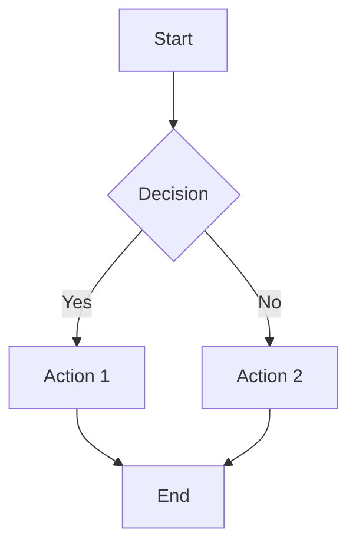
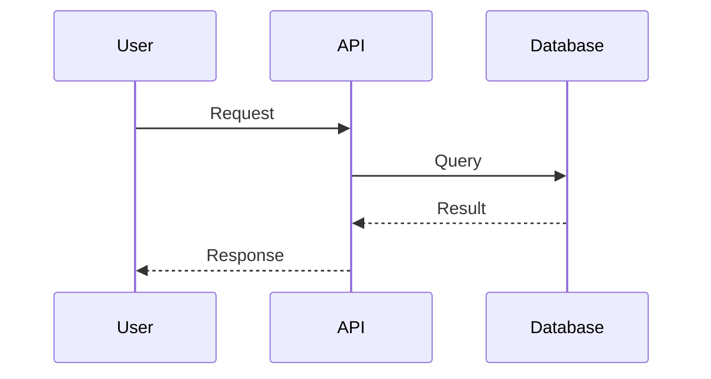
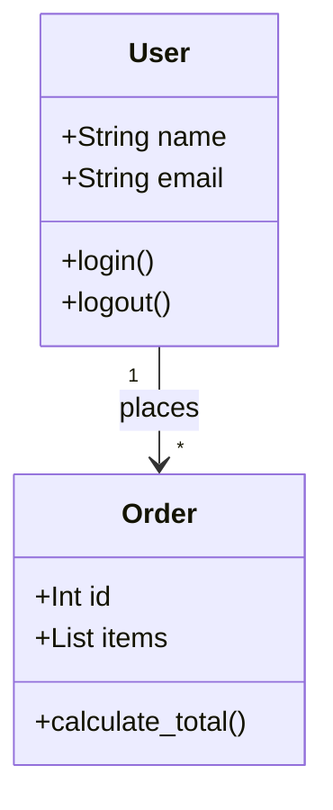
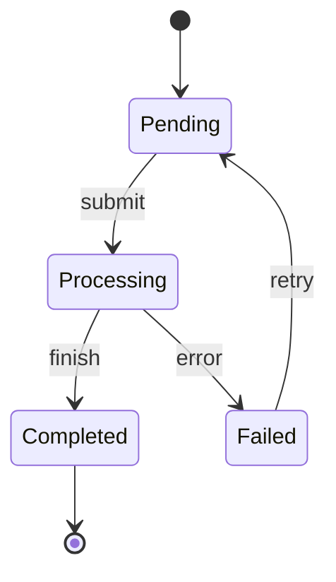
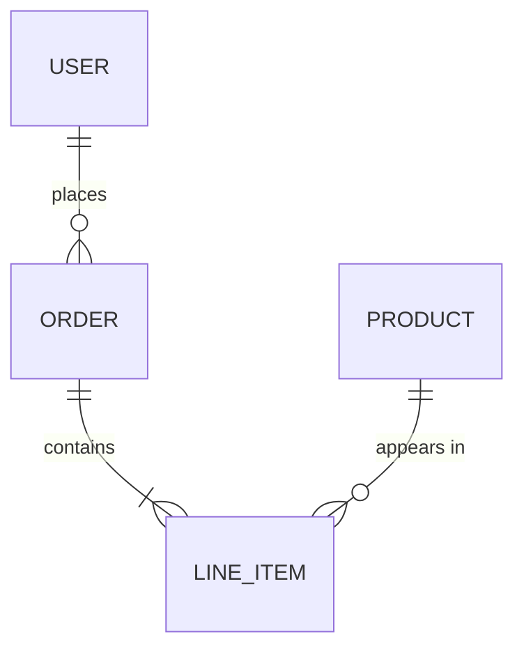
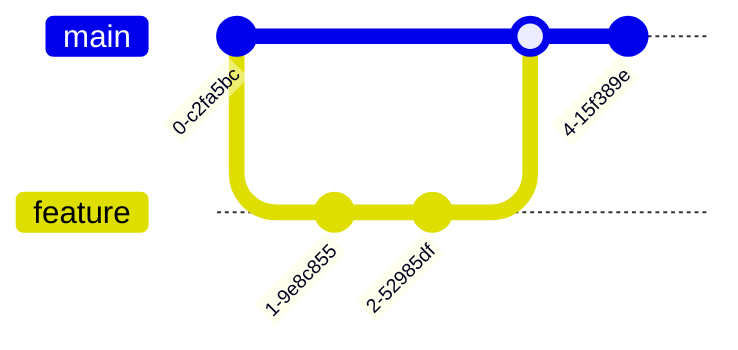
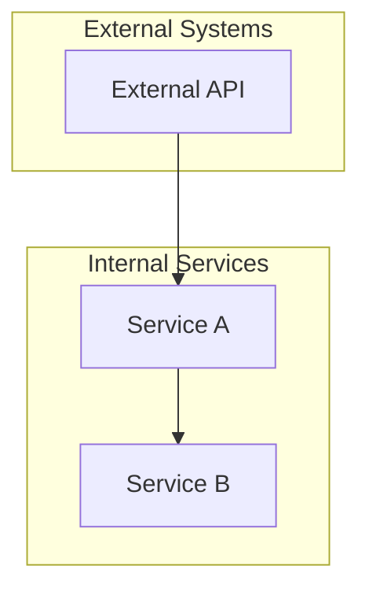
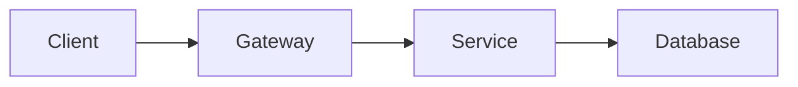
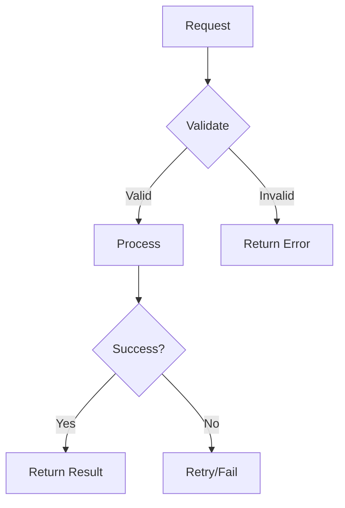
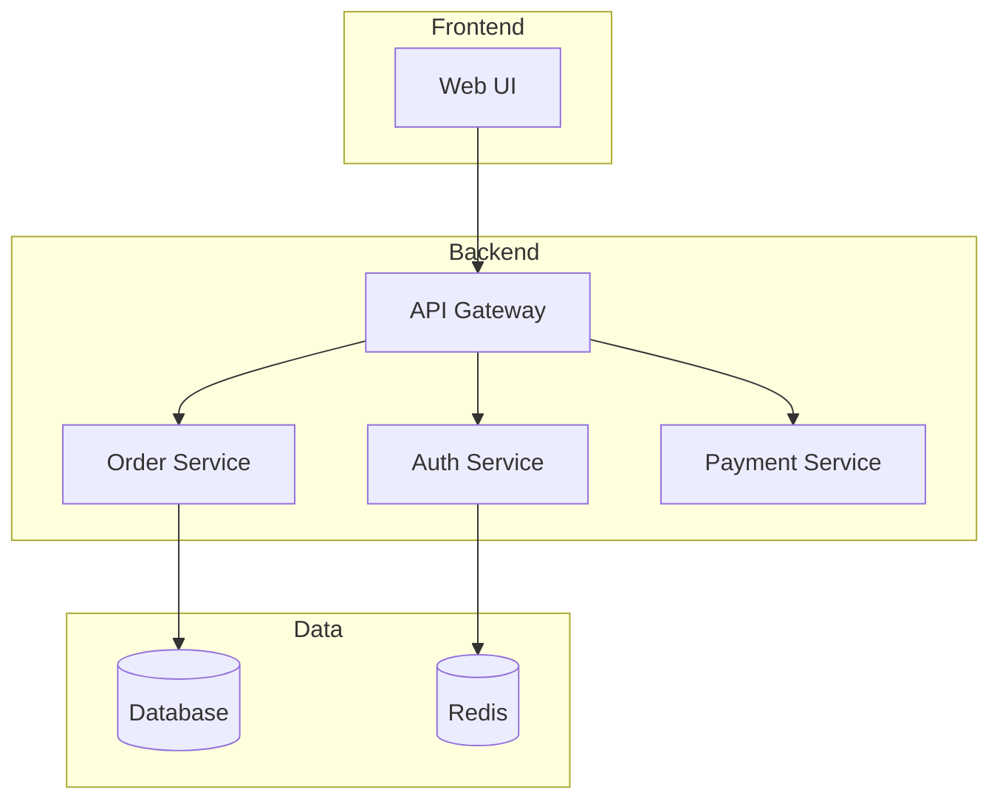

# Mermaid Diagram Generator

Expert at generating Mermaid diagrams for documentation.

## Supported Diagram Types

### 1. Flowcharts


Use for:
- Process flows
- Decision trees
- Algorithm visualization
- User journeys

### 2. Sequence Diagrams


Use for:
- API interactions
- Service communication
- Authentication flows
- Event sequences

### 3. Class Diagrams


Use for:
- Domain models
- Data structures
- OOP designs
- Entity relationships

### 4. State Diagrams


Use for:
- State machines
- Workflow states
- Order status flows
- Process lifecycles

### 5. Entity Relationship Diagrams


Use for:
- Database schemas
- Data models
- Table relationships

### 6. Git Graphs


Use for:
- Git workflows
- Branch strategies
- Release processes

## Best Practices

### Naming Conventions
- Use PascalCase for class/entity names
- Use descriptive labels for edges
- Keep node text concise (3-5 words max)

### Styling Guidelines


- Group related nodes in subgraphs
- Use directional flow (TD = top-down, LR = left-right)
- Add comments for complex diagrams

### Common Patterns

**API Flow:**


**Error Handling:**


**Microservice Communication:**


## Generation Workflow

1. **Identify Diagram Type**: Choose the most appropriate diagram type for the content
2. **Extract Entities**: List all components, actors, or nodes
3. **Define Relationships**: Map connections and flows between entities
4. **Add Details**: Include labels, descriptions, and styling
5. **Validate Syntax**: Ensure Mermaid syntax is correct
6. **Test Rendering**: Verify diagram renders correctly

## Integration with Documentation

Place diagrams in:
- `docs/architecture/` for system architecture
- `docs/flows/` for process flows
- README.md for overview diagrams
- API docs for sequence diagrams

Reference diagrams in markdown:
```markdown
## Architecture Overview

See the system architecture diagram:

\`\`\`mermaid
flowchart TD
    ...
\`\`\`
```

## Commands

- `bash scripts/doc-sync-check.sh check <file>` - Check if diagram docs need updating
- `task docs:validate` - Validate all documentation including diagrams
