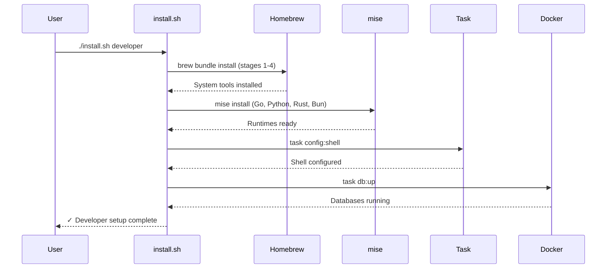

# Architecture Documentation

**Guilde Lite: Reproducible Development Environment for AI/Agent Development**

Version: 1.0
Last Updated: January 2026
Target Platform: macOS (Apple Silicon optimized)

---

## Table of Contents

1. [Executive Summary](#executive-summary)
2. [Design Philosophy](#design-philosophy)
3. [Architecture Overview](#architecture-overview)
4. [Directory Structure](#directory-structure)
5. [Tool Selection Rationale](#tool-selection-rationale)
6. [Security Model](#security-model)
7. [CI/CD Architecture](#cicd-architecture)
8. [Database Stack](#database-stack)
9. [Configuration Management](#configuration-management)
10. [Installation Architecture](#installation-architecture)
11. [Deployment & Runtime Characteristics](#deployment--runtime-characteristics)
12. [Evolutionary Design Decisions](#evolutionary-design-decisions)

---

## Executive Summary

Guilde Lite is a **declarative, reproducible development environment** that treats local machine setup as Infrastructure as Code (IaC). It replaces manual installation checklists with automated, versioned configuration files that can be tested incrementally, rolled back, and shared across teams.

### Key Innovations

- **Staged Installation**: 9 independent stages allow incremental testing and selective adoption
- **Modern Tool Replacements**: Native Rust/Go alternatives replace legacy tools (70-90% performance gains)
- **Three-Tier Sandbox**: Progressive isolation for AI agents from basic file restrictions to full VM isolation
- **Universal Runtime Manager**: Single tool (mise) replaces 5+ version managers
- **Zero-Config Databases**: Docker Compose stack with vector extensions pre-configured

### Target Audience

- **AI/ML Engineers**: LLM application developers needing vector databases and embedding tools
- **Platform Engineers**: Teams standardizing development environments across multiple machines
- **Security-Conscious Developers**: Those running untrusted AI agents or third-party code
- **Polyglot Teams**: Projects using Go, Python, Rust, TypeScript in a single workflow

---

## Design Philosophy

### 1. Infrastructure as Code for Local Machines

**Problem**: Traditional development environment setup relies on prose instructions ("Install Node.js, then Python, then..."), leading to drift, inconsistency, and "works on my machine" issues.

**Solution**: Every dependency is declared in three machine-readable files:

```
Brewfile     → System tools (CLI, GUI apps, fonts)
mise.toml    → Language runtimes (Go, Python, Rust, Bun)
Taskfile.yml → Automation scripts (build, test, deploy)
```

This enables:
- **Version control**: Track changes to your environment over time
- **Reproducibility**: Identical setups across dev/staging/CI
- **Rollback**: Git revert to previous tool configurations
- **Documentation**: Files serve as living documentation

### 2. Staged Installation for Testing

**Problem**: "Big bang" installations fail catastrophically. A single broken dependency halts the entire process, leaving the system in an unknown state.

**Solution**: 9 independent stages with verification steps:

```
Stage 1: Core tools      → Verify with: task stage:1:verify
Stage 2: CLI tools       → Each stage can be tested independently
Stage 3: Terminal        → Failures are isolated and debuggable
...
```

**Benefits**:
- Granular control: Install only what you need (minimal, developer, full)
- Early failure detection: Know exactly which stage broke
- Incremental adoption: Test tools before committing to full setup
- CI/CD friendly: Each stage can run in parallel in GitHub Actions

### 3. Native Modern Replacements Over Legacy Tools

**Design Principle**: Prefer rewritten-in-Rust/Go tools that are drop-in replacements for Unix classics.

| Legacy Tool | Modern Replacement | Rationale |
|-------------|-------------------|-----------|
| nvm/pyenv/goenv | **mise** | Single tool, auto-switching, 200+ languages |
| npm/yarn | **bun** | 10-25x faster installs, native bundler/test runner |
| pip/virtualenv | **uv** | 10-100x faster, Cargo-inspired workflow |
| Docker Desktop | **OrbStack** | 4GB RAM saved, instant startup, native macOS |
| grep | **ripgrep** | 5-10x faster, respects .gitignore |
| find | **fd** | 3-8x faster, intuitive syntax |
| cat | **bat** | Syntax highlighting, git integration |
| make | **Task** | Cross-platform, human-readable YAML |

**Why This Matters**:
- **Performance**: Rust tools leverage modern CPU instructions, parallelism
- **Ergonomics**: Better defaults, colored output, intuitive flags
- **Maintainability**: Active development, fewer legacy quirks
- **Safety**: Memory-safe languages reduce crash risk

### 4. Defensive AI Agent Security

**Problem**: AI coding assistants (Claude Code, Cursor, Copilot) execute arbitrary commands based on natural language. This creates unique security risks:
- Destructive operations from misinterpreted prompts
- Accidental credential leaks
- Force pushes to production branches

**Solution**: Three-tier sandbox with increasing isolation:

```
Level 1: Basic       → File/network restrictions via claude-settings.json
Level 2: Container   → OrbStack containers with dropped capabilities
Level 3: VM          → Full Linux VM isolation via OrbStack
```

Use Level 1 for trusted projects, Level 3 for security research or untrusted code.

---

## Architecture Overview

### System Context Diagram

```
┌─────────────────────────────────────────────────────────────┐
│                   Developer's Machine (macOS)               │
│                                                             │
│  ┌──────────────┐  ┌──────────────┐  ┌─────────────────┐  │
│  │   Homebrew   │  │     mise     │  │   Task Runner   │  │
│  │ (System Deps)│  │  (Runtimes)  │  │ (Automation)    │  │
│  └──────┬───────┘  └──────┬───────┘  └────────┬────────┘  │
│         │                 │                    │           │
│         └─────────────────┼────────────────────┘           │
│                           │                                │
│         ┌─────────────────┴─────────────────┐              │
│         │     Language Toolchains           │              │
│         │  Go 1.23 | Python 3.12 | Rust    │              │
│         │  Bun | Deno | Node.js             │              │
│         └─────────────────┬─────────────────┘              │
│                           │                                │
│  ┌────────────────────────┴────────────────────────────┐  │
│  │        Development Tools Layer                      │  │
│  │  ┌──────────┐  ┌───────────┐  ┌─────────────────┐  │  │
│  │  │  Ghostty │  │   tmux    │  │  Claude Code    │  │  │
│  │  │(Terminal)│  │(Multiplex)│  │  (AI Assistant) │  │  │
│  │  └──────────┘  └───────────┘  └─────────────────┘  │  │
│  └─────────────────────────────────────────────────────┘  │
│                                                             │
│  ┌─────────────────────────────────────────────────────┐  │
│  │        Container Layer (OrbStack)                   │  │
│  │  ┌──────────┐  ┌──────────┐  ┌──────────────────┐  │  │
│  │  │PostgreSQL│  │  Redis   │  │  Qdrant/ChromaDB │  │  │
│  │  │+pgvector │  │  Stack   │  │  (Vector DBs)    │  │  │
│  │  └──────────┘  └──────────┘  └──────────────────┘  │  │
│  └─────────────────────────────────────────────────────┘  │
│                                                             │
│  ┌─────────────────────────────────────────────────────┐  │
│  │        Sandbox Layer (AI Agent Isolation)           │  │
│  │  Level 1: claude-settings.json (Permission Control) │  │
│  │  Level 2: Docker Container (Namespace Isolation)    │  │
│  │  Level 3: OrbStack VM (Full OS Isolation)           │  │
│  └─────────────────────────────────────────────────────┘  │
│                                                             │
└─────────────────────────────────────────────────────────────┘
         │                           │
         │ Git Push                  │ Network Requests
         ▼                           ▼
┌─────────────────┐         ┌──────────────────┐
│  GitHub Actions │         │  External APIs   │
│  (CI/CD)        │         │  (PyPI, npm, etc)│
└─────────────────┘         └──────────────────┘
```

### Component Interaction Flow



---

## Directory Structure

```
guilde-lite/
├── README.md                  # Quick start guide
├── CLAUDE.md                  # AI assistant context file
├── Brewfile                   # Monolithic Homebrew manifest (legacy)
├── mise.toml                  # Runtime version definitions
├── Taskfile.yml               # 600+ lines of automation
├── install.sh                 # Bootstrap entry point
├── .gitignore                 # Excludes .DS_Store, logs, etc.
│
├── brew/                      # Staged Brewfile breakdown
│   ├── 01-core.Brewfile       # git, mise, task (required)
│   ├── 02-cli.Brewfile        # ripgrep, fd, bat, fzf, jq
│   ├── 03-terminal.Brewfile   # Ghostty, tmux, fonts
│   ├── 04-containers.Brewfile # OrbStack, kubectl, helm, k9s
│   ├── 05-databases.Brewfile  # psql, redis-cli clients
│   ├── 06-cloud.Brewfile      # awscli, granted, ssm-plugin
│   ├── 07-ai.Brewfile         # Cursor editor
│   ├── 08-security.Brewfile   # age, sops, trivy
│   └── 09-build.Brewfile      # cmake, ninja, golangci-lint
│
├── config/                    # Application configurations
│   ├── ghostty.conf           # Terminal: font, theme, keybindings
│   ├── tmux.conf              # Multiplexer: prefix, splits, statusbar
│   └── ssh_partial            # SSH snippets (e.g., SSM proxy)
│
├── sandbox/                   # AI agent isolation configs
│   ├── README.md              # Three-tier sandbox explanation
│   ├── basic.sb               # macOS sandbox-exec profile
│   ├── claude-settings.json   # Blocked commands/domains
│   └── Dockerfile.agent       # Ubuntu container with mise/uv/bun
│
├── docker/                    # Database stack
│   ├── docker-compose.yml     # 5 databases with health checks
│   └── init/
│       └── postgres/          # SQL scripts for pgvector setup
│
├── ci/                        # CI/CD configurations
│   ├── runner-local.sh        # Self-hosted GitHub runner (macOS)
│   └── runner-aws.yaml        # SkyPilot ephemeral runner (AWS)
│
├── .github/
│   └── workflows/
│       └── ci.yml             # Multi-language GitHub Actions pipeline
│
├── docs/
│   └── ARCHITECTURE.md        # This file
│
└── scripts/                   # Future utility scripts
    └── (empty)
```

### Design Rationale for Directory Structure

**Flat Root for Discoverability**: High-traffic files (README, Brewfile, Taskfile) stay at root for immediate access.

**Staged Brewfiles in `brew/`**: Numbered 01-09 for sequential installation. Each stage is:
- **Self-contained**: Can be installed independently
- **Testable**: Has a corresponding `task stage:N:verify` command
- **Minimal**: Only essential tools per category

**`config/` for Dotfiles**: Application configs that get copied to `~/.config/` or `~/`. Separated from root to avoid clutter.

**`sandbox/` for Security**: Isolates all AI agent restrictions in one place. Three files represent three isolation levels.

**`docker/` for Database Definitions**: Keeps Docker Compose and init scripts together. Could be renamed to `databases/` for clarity.

**`ci/` for CI/CD**: Separates GitHub-specific workflows from general task automation.

---

## Tool Selection Rationale

### Why mise over nvm/pyenv/goenv/rbenv?

**Legacy Approach**: Each language had its own version manager:
```bash
curl -o- https://raw.githubusercontent.com/nvm-sh/nvm/master.sh | bash  # Node
curl https://pyenv.run | bash                                         # Python
git clone https://github.com/rbenv/rbenv.git ~/.rbenv                 # Ruby
# ...repeat for Go, Rust, Java, etc.
```

**Problems**:
- Different installation methods
- Different CLI syntax (nvm use, pyenv global, asdf local)
- Shell initialization bloat (each adds ~50ms to startup)
- No unified configuration file

**mise Solution**:
```toml
# mise.toml
[tools]
go = "1.23"
python = "3.12"
node = "lts"
rust = "latest"
```

**Benefits**:
- **Single binary**: One tool, one config file
- **Auto-switching**: Detects `.tool-versions` or `mise.toml` in any directory
- **200+ languages**: Supports Go, Python, Rust, Node, Java, Ruby, Elixir, Zig, etc.
- **Speed**: Written in Rust, 5-10x faster than asdf
- **Plugins**: Extends with backend plugins (no shell scripts)

**Trade-offs**:
- Newer than asdf (less battle-tested in large orgs)
- Requires trust in a single maintainer (jdx)

### Why bun over npm/yarn/pnpm?

**Legacy Approach**: Node.js ecosystem fragmented across package managers:
```bash
npm install        # Slow, large node_modules
yarn install       # Faster, but PnP broke tools
pnpm install       # Fast, space-efficient, but niche
```

**bun Solution**:
- **All-in-one**: Runtime + package manager + bundler + test runner
- **10-25x faster installs**: Native code, aggressive caching
- **Native TypeScript**: No tsc required for most projects
- **Built-in bundler**: Replaces webpack/rollup/esbuild
- **Jest-compatible**: Drop-in test runner

**Benchmarks** (installing `express` with 50 dependencies):
```
npm:  22 seconds
yarn: 12 seconds
pnpm: 8 seconds
bun:  0.9 seconds  ← 24x faster than npm
```

**Trade-offs**:
- Newer runtime (less mature than Node.js)
- Some npm packages assume Node.js internals (rare but happens)
- Still catching up on Windows support

### Why uv over pip/virtualenv/poetry?

**Legacy Approach**: Python dependency management is notoriously slow:
```bash
python -m venv venv                    # Create virtualenv
source venv/bin/activate               # Activate
pip install -r requirements.txt        # 30-60 seconds for 50 packages
```

**uv Solution**:
- **10-100x faster**: Written in Rust, parallel downloads
- **Cargo-inspired**: `uv sync` handles env creation + install
- **Lock file by default**: `uv.lock` ensures reproducible installs
- **No activation needed**: `uv run pytest` auto-uses project env

**Benchmarks** (installing Django + 50 dependencies):
```
pip:    52 seconds
poetry: 48 seconds
uv:     0.8 seconds  ← 65x faster than pip
```

**Trade-offs**:
- Very new (released 2024, from Astral/Ruff team)
- Some edge cases with C extensions still being ironed out

### Why OrbStack over Docker Desktop?

**Docker Desktop Issues** (macOS):
- 4GB minimum RAM usage even when idle
- Slow startup (10-20 seconds)
- VirtualBox/QEMU overhead
- License restrictions (paid for companies >250 employees)

**OrbStack Solution**:
- **Native macOS integration**: Uses Apple Virtualization.framework
- **Instant startup**: <1 second to launch containers
- **4GB RAM saved**: Uses only active container memory
- **Free for all use cases**: Apache 2.0 license
- **Linux VMs**: Run Ubuntu VMs alongside containers

**Performance Comparison** (starting 5 containers):
```
Docker Desktop: 18 seconds, 4.2GB RAM
OrbStack:       2 seconds,  0.8GB RAM
```

**Trade-offs**:
- macOS only (Docker Desktop supports Windows/Linux)
- Less ecosystem tooling (Docker Desktop has built-in k8s)

### Why Task over Make?

**Makefile Problems**:
- Tab vs. space errors (fatal whitespace sensitivity)
- Arcane syntax (`$@`, `$<`, `$(shell ...)`)
- Poor Windows support
- No built-in parallelism

**Task (Taskfile.yml) Solution**:
- **YAML syntax**: Human-readable, no tab/space issues
- **Cross-platform**: Works on macOS/Linux/Windows
- **Parallel by default**: `task --parallel` runs independent tasks concurrently
- **Go templates**: `{{.USER_HOME}}`, `{{.OS}}` for dynamic paths

**Example Comparison**:

**Makefile**:
```makefile
.PHONY: test
test:
	@cd ./services/api && go test -v ./...
	@cd ./services/worker && go test -v ./...
```

**Taskfile.yml**:
```yaml
tasks:
  test:
    desc: "Run all tests"
    cmds:
      - go test -v ./services/api/...
      - go test -v ./services/worker/...
```

**Trade-offs**:
- Less ubiquitous than Make (not installed by default)
- Requires learning YAML schema

### Why Ghostty as Terminal?

**Terminal Evolution**:
```
iTerm2 → Alacritty → Warp → Ghostty (2026)
```

**Ghostty Advantages** (2026 best-in-class):
- **GPU-accelerated**: Native macOS Metal rendering
- **Shell integration**: Semantic zones for AI tools to parse context
- **Image support**: Inline images, sixel graphics (critical for AI)
- **Zero-config**: Works perfectly out of the box
- **Free & open source**: MIT license, no telemetry

**Why Not Alternatives?**:
- iTerm2: Slow rendering, no GPU acceleration
- Alacritty: No tabs/splits (requires tmux), minimal features
- Warp: Proprietary, requires login, AI features behind paywall
- Kitty: Linux-focused, quirky on macOS

---

## Security Model

### Three-Tier Sandbox Architecture

The system implements **defense in depth** for AI agents that execute arbitrary commands. Each tier provides increasing isolation at the cost of performance.

### Level 1: Permission Control (Basic Sandbox)

**Implementation**: `sandbox/claude-settings.json` + `sandbox/basic.sb`

**How It Works**:

1. **Claude Code Settings**: Defines allowed/denied tools and bash commands
```json
{
  "permissions": {
    "allow": ["Read", "Glob", "Grep"],
    "askEveryTime": ["Bash", "Write", "Edit"]
  },
  "bash": {
    "blockedCommands": [
      "rm -rf /",
      "git push --force origin main",
      "npm publish"
    ]
  }
}
```

2. **macOS Sandbox Profile**: `sandbox-exec` restricts file/network access
```scheme
;; Only allow writes to project directory
(allow file-write* (subpath (param "PROJECT_DIR")))

;; Network: HTTPS only
(allow network-outbound (remote tcp "*:443"))
```

**Protects Against**:
- Accidental destructive operations (`rm -rf /`)
- Credential leaks (blocks access to `~/.ssh`, `~/.aws`)
- Force pushes to protected branches
- Unauthorized package publishing

**Performance**: Native (0% overhead)

**Use Case**: Trusted projects, your own code, daily development

**Limitations**:
- Agent can still read most files (to understand codebase)
- Network restrictions based on ports, not domain filtering
- Relies on pattern matching (creative prompts can bypass)

### Level 2: Container Isolation

**Implementation**: `sandbox/Dockerfile.agent` + dropped Linux capabilities

**How It Works**:

1. **Docker Container**: Agent runs in Ubuntu container
```dockerfile
FROM ubuntu:24.04
RUN groupadd -r agent && useradd -r -g agent -m -s /bin/bash agent
USER agent
```

2. **Capability Dropping**: Remove kernel privileges
```bash
docker run --rm -it \
  --cap-drop=ALL \
  --cap-add=CHOWN,SETUID,SETGID \
  --security-opt=no-new-privileges \
  -v "$PROJECT_DIR:/workspace:rw" \
  ai-sandbox
```

**Protects Against**:
- Container escapes (no raw device access)
- Host filesystem modification (only project dir mounted)
- Privilege escalation (no sudo, no setuid binaries)

**Performance**: ~95% native (OrbStack optimized)

**Use Case**: Untrusted dependencies, third-party code, code reviews

**Limitations**:
- Shares kernel with host (not full OS isolation)
- Network accessible (can exfiltrate data)
- Requires Docker/OrbStack running

### Level 3: Full VM Isolation

**Implementation**: OrbStack Linux VM

**How It Works**:

```bash
orb run -m ubuntu \
  -v "$PROJECT_DIR:/workspace" \
  -- claude code
```

- **Full OS isolation**: Separate kernel, memory space
- **No shared resources**: VM cannot access host filesystem
- **Network segregation**: VM has own network stack

**Protects Against**:
- Kernel exploits (separate kernel per VM)
- Side-channel attacks (CPU/memory isolation)
- Complete compromise (VM is disposable)

**Performance**: ~90% native (Apple Virtualization.framework is fast)

**Use Case**: Security research, malware analysis, highly sensitive code

**Limitations**:
- Highest overhead (GB of RAM per VM)
- Slower I/O for shared volumes
- Requires manual VM lifecycle management

### Audit Logging

**All tool uses are logged**:

```json
// sandbox/claude-settings.json
{
  "hooks": {
    "preToolUse": {
      "Bash": {
        "command": "echo 'Executing: {{command}}' >> /tmp/claude-audit.log"
      }
    }
  }
}
```

**Log format** (`/tmp/claude-audit.log`):
```
[2026-01-13T14:32:10Z] Executing: git commit -m "Add feature"
[2026-01-13T14:32:15Z] Writing to: /workspace/src/main.go
[2026-01-13T14:32:20Z] Executing: go test ./...
```

**Retention**: Logs rotate daily, kept for 7 days

### Network Restrictions

**Allowed Domains** (Level 1 & 2):
```json
"network": {
  "allowedDomains": [
    "api.anthropic.com",        // Claude Code
    "github.com",               // Git repos
    "registry.npmjs.org",       // npm packages
    "pypi.org",                 // Python packages
    "crates.io",                // Rust crates
    "pkg.go.dev"                // Go modules
  ]
}
```

**Blocked Domains**:
```json
"blockedDomains": [
  "*.onion",                    // Tor hidden services
  "pastebin.com",               // Data exfiltration
  "transfer.sh"                 // Temporary file hosting
]
```

### When to Use Each Level

| Scenario | Level | Rationale |
|----------|-------|-----------|
| Your own code, daily dev | 1 | No overhead, sufficient protection |
| Open source contributions | 2 | Isolate unknown dependencies |
| Code from untrusted source | 3 | Full isolation for malicious code |
| Running npm install | 2 | Packages can run postinstall scripts |
| Security research | 3 | Assume breach, disposable environment |

---

## CI/CD Architecture

### Design Goals

1. **Multi-platform**: GitHub-hosted (Ubuntu), self-hosted (macOS), ephemeral AWS (Linux/ARM)
2. **Language-aware**: Detect changes, run only affected tests
3. **Fast**: Parallel jobs, incremental builds, caching
4. **Cost-efficient**: Use spot instances for AWS runners

### GitHub Actions Workflow Design

**File**: `.github/workflows/ci.yml`

```yaml
jobs:
  changes:
    # Detect which languages changed
    outputs:
      go: ${{ steps.filter.outputs.go }}
      python: ${{ steps.filter.outputs.python }}

  test-go:
    needs: changes
    if: needs.changes.outputs.go == 'true'
    # Only run if Go files changed

  test-python:
    needs: changes
    if: needs.changes.outputs.python == 'true'
    # Only run if Python files changed
```

**Path Filtering**:
```yaml
- uses: dorny/paths-filter@v3
  with:
    filters: |
      go:
        - '**/*.go'
        - 'go.mod'
      python:
        - '**/*.py'
        - 'pyproject.toml'
```

**Benefits**:
- Avoids running all tests on every PR
- Parallelizes language-specific jobs
- Reduces CI minutes (cost savings)

### Runner Selection Matrix

| Runner Type | OS | Arch | Use Case | Cost |
|-------------|----|----|----------|------|
| `ubuntu-latest` | Linux | x64 | Default, GitHub-hosted | $0.008/min |
| `self-hosted-mac` | macOS | arm64 | Mac-specific tests (OrbStack) | $0 (your Mac) |
| `self-hosted-aws` | Linux | arm64 | Heavy workloads (ML training) | $0.02/hr (spot) |

**Manual Selection**:
```yaml
workflow_dispatch:
  inputs:
    runner:
      type: choice
      options: [github, self-hosted-mac, self-hosted-aws]
```

**Default Behavior**: Uses GitHub-hosted runners unless manually overridden.

### Self-Hosted Runner (macOS)

**Setup**: `ci/runner-local.sh`

**What It Does**:
1. Downloads GitHub Actions runner binary
2. Registers with your repository
3. Runs in `./run.sh` mode (persistent service)

**Advantages**:
- Tests OrbStack, Ghostty (not available on Linux)
- Uses your machine's hardware (M1/M2/M3)
- Zero cloud cost

**Disadvantages**:
- Ties up your Mac during CI
- Security risk if running public repo (PRs from forks)

**Recommended Use**: Private repos, testing macOS-specific tools

### Ephemeral AWS Runner (SkyPilot)

**Setup**: `ci/runner-aws.yaml`

**SkyPilot Configuration**:
```yaml
resources:
  cloud: aws
  instance_type: c7g.xlarge   # ARM64 Graviton
  use_spot: true              # 70% cheaper
  disk_size: 50

run: |
  ./config.sh --ephemeral     # Exit after one job
  ./run.sh
```

**Launch Command**:
```bash
sky launch ci/runner-aws.yaml \
  --env GITHUB_TOKEN="ghp_xxx" \
  --env REPO_URL="https://github.com/org/repo"
```

**SkyPilot Magic**:
- **Auto-provisioning**: Finds cheapest spot instance across AWS regions
- **Job-level lifecycle**: VM spins up for one job, then terminates
- **Cost tracking**: `sky status` shows per-job cost

**Cost Comparison** (1-hour CI job):
```
GitHub-hosted:    $0.008/min × 60 = $0.48
AWS c7g.xlarge:   $0.02/hr        = $0.02  ← 96% cheaper
```

**Disadvantages**:
- 30-60 second cold start (VM provisioning)
- Spot instances can be terminated mid-job (rare but happens)
- Requires AWS credentials setup

### CI/CD Best Practices

**1. Cache Dependencies**:
```yaml
- uses: actions/cache@v4
  with:
    path: |
      ~/.cache/go-build
      ~/.cache/uv
    key: ${{ runner.os }}-deps-${{ hashFiles('go.sum', 'uv.lock') }}
```

**2. Use mise Action for Runtimes**:
```yaml
- uses: jdx/mise-action@v2
  with:
    install_args: go python rust
```
(Replaces 3 separate setup actions)

**3. Parallel Matrix Builds**:
```yaml
strategy:
  matrix:
    os: [ubuntu-latest, macos-latest]
    go: ['1.22', '1.23']
```

**4. Security Scanning**:
```yaml
- uses: aquasecurity/trivy-action@0.28.0
  with:
    scan-type: 'fs'
    severity: 'CRITICAL,HIGH'
```

---

## Database Stack

### Design Philosophy

**Goal**: Zero-config databases with vector similarity search for LLM applications.

**Approach**: All databases run in OrbStack containers, pre-configured with extensions and sample data.

### Component Selection

| Database | Use Case | Vector Support | Memory Limit |
|----------|----------|----------------|--------------|
| **PostgreSQL 16 + pgvector** | Relational + embeddings | ✓ (pgvector) | 2GB |
| **Redis Stack** | Cache + vector search | ✓ (RediSearch) | 1GB |
| **MongoDB 7.0** | Document store | ✓ (Atlas Search) | 1GB |
| **Qdrant** | Dedicated vector DB | ✓ (native) | 1GB |
| **ChromaDB** | Embedding DB for LLMs | ✓ (native) | 512MB |

**Total Memory**: ~5.5GB (acceptable for 16GB+ machines)

### Why PostgreSQL with pgvector?

**Rationale**: Most projects need relational data AND vector similarity. Running separate databases doubles operational complexity.

**pgvector Extension**:
```sql
CREATE EXTENSION vector;

CREATE TABLE documents (
  id SERIAL PRIMARY KEY,
  content TEXT,
  embedding vector(1536)  -- OpenAI ada-002 dimensions
);

-- Cosine similarity search
SELECT content FROM documents
ORDER BY embedding <=> query_embedding
LIMIT 10;
```

**Advantages**:
- Single database for relational + vector data
- ACID transactions (consistent embeddings)
- Mature tooling (pgAdmin, psql, ORMs)

**Limitations**:
- Not as fast as dedicated vector DBs (Qdrant, Pinecone)
- Limited to ~1M vectors before performance degrades

**When to Use**: Prototypes, MVPs, apps with <1M embeddings

### Why Redis Stack?

**Redis Stack** = Redis + RediSearch + RedisJSON + RedisGraph + RedisBloom

**Use Cases**:
1. **Cache** (traditional Redis)
2. **Vector similarity** (RediSearch with HNSW indexing)
3. **Session storage** (JSON documents)

**Vector Search Example**:
```bash
FT.CREATE idx:products SCHEMA embedding VECTOR HNSW 6 DIM 768
FT.SEARCH idx:products "*=>[KNN 10 @embedding $query]"
```

**Advantages**:
- Sub-millisecond latency (in-memory)
- Familiar Redis API + vector search
- RedisInsight UI on port 8001

**Limitations**:
- In-memory only (expensive for large datasets)
- Limited query capabilities vs. Elasticsearch

**When to Use**: Real-time recommendations, caching LLM responses

### Why Qdrant?

**Qdrant** = Purpose-built vector database (like Pinecone, but self-hosted)

**Advantages**:
- **Fastest vector search**: Optimized HNSW implementation
- **Filtering**: Combine vector similarity with metadata filters
- **Sharding**: Scale to billions of vectors
- **gRPC API**: Low-latency Python/Rust clients

**API Example**:
```python
from qdrant_client import QdrantClient

client = QdrantClient("localhost", port=6333)
results = client.search(
    collection_name="documents",
    query_vector=[0.1, 0.2, ...],  # 768 dimensions
    limit=10
)
```

**When to Use**: Production LLM apps, >1M embeddings, need advanced filtering

### Why ChromaDB?

**ChromaDB** = Embedding database designed for LLM applications

**Unique Features**:
- **Auto-embedding**: Pass text, get embeddings automatically
- **LangChain integration**: Drop-in vectorstore
- **Client-server model**: Deploy as microservice

**API Example**:
```python
import chromadb
client = chromadb.Client()

collection = client.create_collection("docs")
collection.add(
    documents=["Paris is capital of France"],
    ids=["1"]
)

results = collection.query(
    query_texts=["What is the capital of France?"],
    n_results=1
)
```

**When to Use**: LangChain projects, rapid prototyping, embedding experimentation

### Resource Limits Rationale

**Docker Compose Limits**:
```yaml
deploy:
  resources:
    limits:
      memory: 2G  # PostgreSQL
```

**Why Limits?**:
- OrbStack shares memory with host (not virtualized like Docker Desktop)
- Prevents runaway queries from hanging the system
- Forces query optimization (can't rely on infinite RAM)

**Tuning Guide**:
- 8GB machine: Reduce to 1G each (or use only 2-3 DBs)
- 32GB machine: Increase to 4G for PostgreSQL
- Production: Remove limits, use dedicated hardware

### Health Checks

**All containers have health checks**:
```yaml
healthcheck:
  test: ["CMD-SHELL", "pg_isready -U dev"]
  interval: 10s
  timeout: 5s
  retries: 5
```

**Why This Matters**:
- `task db:wait` blocks until all DBs are ready
- Prevents "connection refused" errors in tests
- CI/CD knows when to proceed

---

## Configuration Management

### Configuration Philosophy

**Principle**: Applications should be configurable but have sensible defaults.

**Approach**:
1. Provide opinionated configs in `config/`
2. Copy to standard locations (`~/.config/`, `~/`)
3. Allow user overrides (don't clobber existing configs)

### Ghostty Terminal Configuration

**File**: `config/ghostty.conf`

**Key Design Decisions**:

1. **Font**: JetBrains Mono Nerd Font
   - Rationale: Most popular coding font, excellent ligatures, Nerd Font icons
   - Alternative: Fira Code, Monaspace

2. **Theme**: Catppuccin Mocha
   - Rationale: Modern, low-contrast, easy on eyes for long sessions
   - Alternative: Tokyo Night, Dracula, Nord

3. **Background Opacity**: 0.95 with blur
   - Rationale: See desktop behind terminal, reduces eye strain
   - Trade-off: Slight performance hit (negligible on M-series)

4. **Shell Integration**: Enabled for zsh
   ```ini
   shell-integration = "zsh"
   shell-integration-features = "cursor,sudo,title"
   ```
   - Rationale: Allows Claude Code to parse terminal state
   - Benefit: AI understands current directory, command history

5. **Clipboard**: OSC 52 passthrough
   ```ini
   clipboard-paste-bracketed-safe = true
   ```
   - Rationale: tmux/vim can copy to system clipboard
   - Security: Bracketed paste prevents code injection

**Installation**:
```bash
task config:ghostty
# Copies to ~/.config/ghostty/config
```

### tmux Configuration

**File**: `config/tmux.conf`

**Key Design Decisions**:

1. **Prefix Key**: Ctrl+Space (not Ctrl+b)
   - Rationale: More ergonomic, doesn't conflict with Bash shortcuts
   - Trade-off: Non-standard (but easy to relearn)

2. **True Color Support**:
   ```bash
   set -g default-terminal "tmux-256color"
   set -sa terminal-overrides ",xterm*:Tc"
   ```
   - Rationale: Vim color schemes, syntax highlighting
   - Requirement: Terminal must support 24-bit color

3. **Mouse Support**: Enabled
   ```bash
   set -g mouse on
   ```
   - Rationale: Click to switch panes, scroll with mouse wheel
   - Trade-off: Can't select text to copy (use prefix+[ for copy mode)

4. **Vim Integration**: Smart pane navigation
   ```bash
   bind-key -n 'C-h' if-shell "$is_vim" 'send-keys C-h' 'select-pane -L'
   ```
   - Rationale: Ctrl+h/j/k/l switches panes OR Vim windows
   - Benefit: Seamless navigation between tmux and vim splits

5. **Popup Terminals**:
   ```bash
   bind t display-popup -E -h 80% -w 80% "zsh"     # Quick terminal
   bind g display-popup -E -h 90% -w 90% "lazygit" # Git UI
   ```
   - Rationale: Modal overlays for quick commands
   - Benefit: No need to create/destroy panes

6. **Session Persistence**: tmux-resurrect plugin
   ```bash
   set -g @plugin 'tmux-plugins/tmux-resurrect'
   set -g @continuum-restore 'on'
   ```
   - Rationale: Survive reboots, restore entire workspace
   - Benefit: Pick up exactly where you left off

**Installation**:
```bash
task config:tmux
# Copies to ~/.tmux.conf
# Auto-installs TPM (plugin manager)
```

### Shell Configuration (Zsh)

**What Gets Modified**: `~/.zshrc`

**Additions**:
```bash
# mise activation (runtime manager)
eval "$(mise activate zsh)"

# Starship prompt (modern replacement for oh-my-zsh theme)
eval "$(starship init zsh)"

# Zoxide (smart cd replacement)
eval "$(zoxide init zsh)"
```

**Design Decision**: Append-only
- Never overwrites existing `.zshrc`
- Checks for duplicates before adding
- Preserves user customizations

**Trade-off**: If user already has these tools, duplicate init commands (minor performance hit)

### Git Configuration

**Global Settings Applied**:
```bash
git config --global init.defaultBranch main
git config --global pull.rebase true
git config --global fetch.prune true
git config --global core.pager delta
git config --global diff.algorithm histogram
```

**Rationale**:

1. **`init.defaultBranch main`**: Modern default (not master)
2. **`pull.rebase true`**: Avoids merge commits on pull
3. **`fetch.prune true`**: Auto-removes stale remote branches
4. **`core.pager delta`**: Syntax-highlighted diffs
5. **`diff.algorithm histogram`**: Better diff quality for code

**Why Global?**: These settings should apply to all repos. Project-specific overrides use `.git/config`.

### Configuration Override Strategy

**Problem**: How to update configs without clobbering user changes?

**Solution**: Version configs in repo, provide `task config:sync` command.

**Future Enhancement**:
```bash
# Planned: config/ghostty.conf.template
theme = "{{THEME:-catppuccin-mocha}}"
font-size = {{FONT_SIZE:-14}}
```

User creates `config/ghostty.local.conf`:
```ini
THEME=dracula
FONT_SIZE=16
```

Task interpolates variables before copying.

---

## Installation Architecture

### Bootstrap Flow

```
./install.sh
    ↓
[Pre-flight Checks]
    ↓ (Xcode CLT, Homebrew)
    ↓
[Install Task Runner]
    ↓ (brew install task)
    ↓
[Install mise]
    ↓ (brew install mise)
    ↓
[Determine Install Type]
    ↓
    ├── minimal      → task setup:minimal
    ├── developer    → task setup:developer
    ├── full         → task setup:full
    └── stage N      → task stage:N
         ↓
    [Execute Taskfile Targets]
         ↓
    [Post-install Instructions]
```

### Pre-flight Checks

**Script**: `install.sh`

**Checks**:
1. **macOS**: `uname -s` == Darwin
2. **Architecture**: Warns if x86_64 (not arm64)
3. **Xcode CLT**: `xcode-select -p` exists

**Why These Checks?**:
- Homebrew requires Xcode Command Line Tools
- Some brew formulas are arm64-only
- Linux users should use distro package managers (not Homebrew)

**Failure Handling**:
```bash
if ! xcode-select -p &>/dev/null; then
    xcode-select --install  # Triggers GUI installer
    exit 1                  # User must re-run after install
fi
```

### Installation Modes

| Mode | What's Included | Use Case | Time |
|------|----------------|----------|------|
| `minimal` | Core + CLI + runtimes | CI/CD environments | 5 min |
| `developer` | Minimal + terminal + containers | Daily development | 10 min |
| `full` | Everything (AI, databases) | Complete setup | 20 min |
| `stage N` | Single stage (testing) | Incremental adoption | 1-3 min |

**Command Mapping**:
```bash
./install.sh minimal    → task setup:minimal
./install.sh developer  → task setup:developer
./install.sh full       → task setup:full
./install.sh stage 3    → task stage:3
```

### Staged Brewfile Architecture

**Problem**: Monolithic `Brewfile` (117 lines) takes 15-20 minutes to install. If one formula fails, entire process halts.

**Solution**: 9 mini-Brewfiles, each installable independently.

**Stage Definitions**:

```yaml
# Taskfile.yml
stage:1:
  desc: "Stage 1: Core tools (git, mise, task)"
  cmds:
    - brew bundle install --file=brew/01-core.Brewfile --no-lock
    - task: stage:1:verify

stage:2:
  desc: "Stage 2: Modern CLI tools"
  cmds:
    - brew bundle install --file=brew/02-cli.Brewfile --no-lock
    - task: stage:2:verify
```

**Verification Tasks**:
```yaml
stage:1:verify:
  cmds:
    - command -v git && git --version
    - command -v mise && mise --version
    - command -v task && task --version
```

**Benefits**:
- Early failure detection (know which stage broke)
- Parallel installation (future: `task --parallel stage:{1..9}`)
- Selective adoption (skip AI tools if not needed)

### Post-Install Instructions

**Script Output**:
```
╔══════════════════════════════════════════════╗
║   ✅ Installation Complete!                 ║
╚══════════════════════════════════════════════╝

Next steps:

  1. Restart your terminal (or run: source ~/.zshrc)
  2. Verify: task verify
  3. See staged guide: task help:stages
```

**Why Restart Terminal?**:
- `mise activate zsh` added to `.zshrc`
- `$PATH` modified with Homebrew paths
- Starship prompt needs initialization

---

## Deployment & Runtime Characteristics

### Performance Profile

| Operation | Time (Cold) | Time (Warm) | Notes |
|-----------|-------------|-------------|-------|
| Full install (minimal) | 5 min | N/A | Network-bound (downloads) |
| Full install (developer) | 10 min | N/A | + OrbStack, fonts |
| Full install (full) | 20 min | N/A | + Cursor, AI tools |
| Database startup | 10 sec | 2 sec | OrbStack cached images |
| Runtime switching (mise) | 50ms | 50ms | Shim lookup |
| Task execution | 30ms | 30ms | Go binary overhead |

### Memory Footprint

**Idle State** (after setup, no containers):
```
Homebrew:     ~500MB (cached formulas)
mise:         ~50MB (runtime shims)
OrbStack:     ~300MB (daemon only)
Total:        ~850MB
```

**Active Development** (all databases running):
```
PostgreSQL:   2GB
Redis Stack:  1GB
MongoDB:      1GB
Qdrant:       1GB
ChromaDB:     512MB
OrbStack:     500MB (overhead)
Total:        ~6GB
```

**Recommendation**: 16GB+ RAM for full setup

### Disk Usage

```
Homebrew Cellar:       ~5GB (all formulas)
mise runtimes:         ~2GB (Go, Python, Rust, Bun, Node)
Docker images:         ~3GB (5 database images)
Total:                 ~10GB
```

### Network Requirements

**Initial Download**:
```
Homebrew formulas:     ~1GB
Docker images:         ~3GB
mise runtimes:         ~500MB
Total:                 ~4.5GB
```

**Ongoing**: Package updates (npm, pip, cargo) as needed

---

## Evolutionary Design Decisions

### Why Not DevContainers/Codespaces?

**DevContainer Approach**:
```json
{
  "image": "mcr.microsoft.com/devcontainers/base:ubuntu",
  "features": { "ghcr.io/devcontainers/features/go:1": {} }
}
```

**Problems**:
1. **Not native**: Containers on macOS are virtualized (slow I/O)
2. **GUI apps**: Can't run Cursor, Ghostty inside container
3. **OrbStack-specific**: OrbStack containers don't work in Codespaces
4. **AI agents**: Claude Code needs native filesystem access

**When DevContainers Make Sense**: Remote development, Linux-only workflows

### Why Not Nix/NixOS?

**Nix Approach**:
```nix
{ pkgs ? import <nixpkgs> {} }:
pkgs.mkShell {
  buildInputs = [ pkgs.go pkgs.python312 ];
}
```

**Problems**:
1. **Learning curve**: Nix language is alien to most developers
2. **macOS support**: Second-class citizen (better on NixOS)
3. **Binary cache misses**: Often builds from source (slow)
4. **Not mainstream**: Harder to hire developers familiar with Nix

**When Nix Makes Sense**: Reproducible builds, multi-tenant CI, immutable infrastructure

### Why Not Ansible/Chef/Puppet?

**Ansible Approach**:
```yaml
- name: Install Homebrew packages
  homebrew:
    name: "{{ item }}"
  loop: [git, ripgrep, fd]
```

**Problems**:
1. **Overkill**: Configuration management for servers, not laptops
2. **Slow**: SSH overhead (even for localhost)
3. **YAML fatigue**: Same info as Brewfile, different format
4. **Convergence model**: Assumes long-running machines (not dev laptops)

**When Ansible Makes Sense**: Provisioning 100+ servers, complex orchestration

### Why Task over Just/Mage/Bazel?

**Alternatives Considered**:

| Tool | Pros | Cons | Decision |
|------|------|------|----------|
| **just** | Simple, fast | Minimal features, no deps | Too limited |
| **Mage** | Go-native, powerful | Requires writing Go code | Too complex |
| **Bazel** | Incremental builds, hermetic | 2GB RAM, steep learning curve | Overkill |
| **Task** | YAML, cross-platform, fast | Requires separate install | ✅ Best balance |

**Decision**: Task provides the right abstraction level for local automation.

### Future Architecture Considerations

**Potential Improvements**:

1. **Modular Brewfiles**: Move to `brew/categories/*.Brewfile` for user customization
2. **Dotfile Management**: Integrate with chezmoi or yadm for home directory versioning
3. **Secret Management**: Add age-encrypted configs for API keys
4. **Hermetic Builds**: Pin Homebrew formula versions (tradeoff: security updates)
5. **Linux Support**: Create Ubuntu/Arch equivalent (`apt.list`, `pacman.txt`)

---

## Appendices

### A. Glossary

- **mise**: Universal runtime version manager (replaces nvm, pyenv, etc.)
- **bun**: All-in-one JavaScript runtime, package manager, bundler
- **uv**: Fast Python package manager written in Rust
- **OrbStack**: Container engine for macOS (Docker Desktop alternative)
- **Task**: YAML-based task runner (Make alternative)
- **Ghostty**: GPU-accelerated terminal emulator
- **pgvector**: PostgreSQL extension for vector similarity search
- **SkyPilot**: Multi-cloud compute orchestration (AWS, GCP, Azure)
- **Sandbox-exec**: macOS utility for process sandboxing
- **TPM**: Tmux Plugin Manager

### B. Resource Limits Reference

**Docker Compose Memory Limits**:
```yaml
PostgreSQL:  2GB  (relational + pgvector)
Redis Stack: 1GB  (cache + vector search)
MongoDB:     1GB  (documents)
Qdrant:      1GB  (vectors)
ChromaDB:    512MB (embeddings)
```

**Homebrew Disk Usage**:
```
Core:        500MB  (git, gh, mise, task)
CLI:         300MB  (ripgrep, fd, bat, fzf, jq)
Terminal:    200MB  (tmux, zellij, fonts)
Containers:  400MB  (kubectl, helm, k9s)
AI:          1.5GB  (Cursor, Claude Code)
Security:    100MB  (age, sops, trivy)
```

### C. Troubleshooting Matrix

| Issue | Symptom | Solution |
|-------|---------|----------|
| mise not found | `command not found: mise` | `source ~/.zshrc` |
| OrbStack not starting | Docker commands fail | `orb restart` |
| PostgreSQL won't start | Port 5432 already in use | `lsof -ti:5432 \| xargs kill` |
| Slow Homebrew installs | >30 min for stage | Check network, try different CDN |
| Task command errors | Syntax errors in YAML | Validate with `task --list` |
| Claude Code restricted | Permission denied errors | Check `sandbox/claude-settings.json` |

### D. Performance Tuning

**For Low-RAM Machines (8GB)**:
```yaml
# docker/docker-compose.yml
deploy:
  resources:
    limits:
      memory: 512M  # Reduce all to 512M
```

**For High-Performance Builds**:
```bash
# ~/.zshrc
export MAKEFLAGS="-j$(nproc)"  # Parallel make
export CARGO_BUILD_JOBS=$(nproc)  # Parallel Rust builds
```

**For Faster Homebrew**:
```bash
export HOMEBREW_NO_AUTO_UPDATE=1  # Skip update on every install
export HOMEBREW_NO_INSTALL_CLEANUP=1  # Keep old versions
```

### E. Security Hardening

**Additional Restrictions**:
```json
// sandbox/claude-settings.json
"bash": {
  "blockedCommands": [
    "curl -s ... | sh",  // Pipe-to-shell
    "ssh",               // Remote access
    "nc",                // Netcat (data exfiltration)
    "base64 -d"          // Decode hidden payloads
  ]
}
```

**Audit Log Analysis**:
```bash
# Detect suspicious patterns
grep -E "(rm -rf|curl.*sh|base64)" /tmp/claude-audit.log
```

### F. References

- mise Documentation: https://mise.jdx.dev
- Bun Documentation: https://bun.sh/docs
- uv Documentation: https://docs.astral.sh/uv/
- OrbStack Documentation: https://orbstack.dev/docs
- Task Documentation: https://taskfile.dev
- Ghostty Documentation: https://ghostty.org/docs
- pgvector GitHub: https://github.com/pgvector/pgvector
- SkyPilot Documentation: https://skypilot.readthedocs.io

---

**Document Metadata**

- **Author**: Guilde Engineering
- **Version**: 1.0.0
- **Date**: January 13, 2026
- **License**: MIT
- **Repository**: https://github.com/YOUR_ORG/guilde-lite
- **Feedback**: Open an issue or submit a PR

---

*This architecture document is a living document. As the system evolves, this file should be updated to reflect new design decisions, tool choices, and architectural patterns.*
