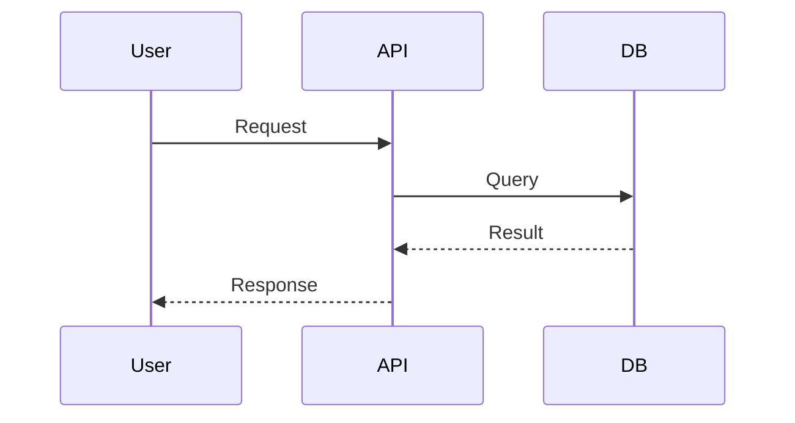
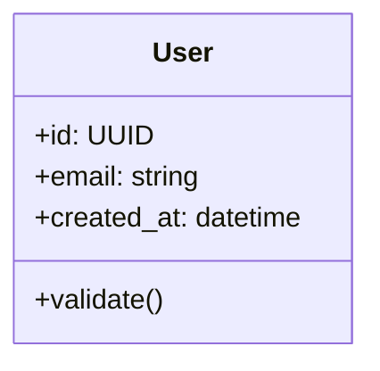
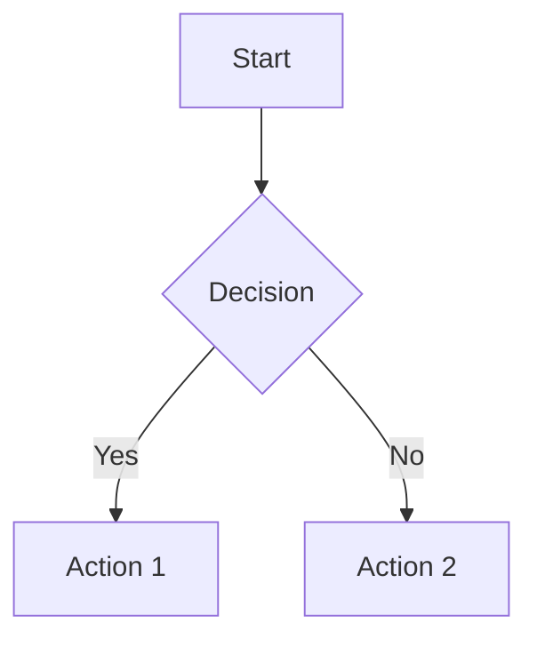

# Multi-Agent Workflow Architecture

**Version:** 1.0.0
**Last Updated:** January 2026
**Status:** Planning Phase

---

## Table of Contents

1. [Executive Summary](#executive-summary)
2. [Architecture Overview](#architecture-overview)
3. [Conductor/Orchestrator Pattern](#conductororchestrator-pattern)
4. [Subagent Specializations](#subagent-specializations)
5. [Multi-Agent Consensus Mechanisms](#multi-agent-consensus-mechanisms)
6. [Version Control with Jujutsu (jj)](#version-control-with-jujutsu-jj)
7. [Context Engineering](#context-engineering)
8. [TDD Integration](#tdd-integration)
9. [Documentation Automation](#documentation-automation)
10. [Telemetry & Observability](#telemetry--observability)
11. [Quality Assurance](#quality-assurance)
12. [Hookify Rules & Enforcement](#hookify-rules--enforcement)
13. [Skill Packaging & Reuse](#skill-packaging--reuse)
14. [Implementation Roadmap](#implementation-roadmap)

---

## Executive Summary

This document defines a comprehensive multi-agent workflow architecture for Claude Code that enables:

- **Conductor-driven orchestration** with context-as-code principles
- **Parallel subagent execution** for specialized tasks
- **Context engineering** for resumable, multi-session workflows
- **TDD-first development** enforced via hooks
- **Automated documentation** synchronized with source code
- **Full telemetry** for tracking all AI agent interactions

### Core Principles

| Principle | Description |
|-----------|-------------|
| **Context as Code** | All workflow state persisted in version-controlled markdown files |
| **Plan Before Build** | Structured specs and plans precede any implementation |
| **Human-in-the-Loop** | Critical decisions require explicit user approval |
| **Parallel by Default** | Independent tasks run concurrently via subagents |
| **Consensus for Complexity** | Multiple agents reach agreement on high-impact decisions |
| **Lock-Free Version Control** | jj enables concurrent agent work without merge conflicts |
| **TDD Discipline** | Red-green-refactor cycles enforced via hooks |
| **Single Source of Truth** | Documentation auto-generated from source code |

---

## Architecture Overview

### System Context Diagram

```
                         ┌─────────────────────────────────────────┐
                         │              USER                       │
                         └────────────────┬────────────────────────┘
                                          │
                                          ▼
┌─────────────────────────────────────────────────────────────────────────────┐
│                            CONDUCTOR LAYER                                  │
│  ┌───────────────────────────────────────────────────────────────────────┐  │
│  │                     conductor/                                        │  │
│  │  ├── product.md          # Product vision, users, goals               │  │
│  │  ├── tech-stack.md       # Technologies and patterns                  │  │
│  │  ├── workflow.md         # TDD workflow, quality gates                │  │
│  │  ├── tracks.md           # Master list of all work tracks             │  │
│  │  └── tracks/                                                          │  │
│  │      └── <track_id>/                                                  │  │
│  │          ├── spec.md     # Requirements and acceptance criteria       │  │
│  │          └── plan.md     # Phased implementation with tasks           │  │
│  └───────────────────────────────────────────────────────────────────────┘  │
└─────────────────────────────────────────────────────────────────────────────┘
                                          │
                    ┌─────────────────────┼─────────────────────┐
                    ▼                     ▼                     ▼
┌───────────────────────────┐ ┌───────────────────────────┐ ┌───────────────────────────┐
│    RESEARCH AGENTS        │ │    DEVELOPMENT AGENTS     │ │    REVIEW AGENTS          │
│                           │ │                           │ │                           │
│  • context-explorer       │ │  • backend-architect      │ │  • code-reviewer          │
│  • spec-builder           │ │  • frontend-developer     │ │  • security-auditor       │
│  • docs-researcher        │ │  • test-automator         │ │  • architect-reviewer     │
│  • codebase-analyzer      │ │  • database-optimizer     │ │  • tdd-orchestrator       │
└───────────────────────────┘ └───────────────────────────┘ └───────────────────────────┘
                    │                     │                     │
                    └─────────────────────┼─────────────────────┘
                                          ▼
┌─────────────────────────────────────────────────────────────────────────────┐
│                            CONTEXT LAYER                                    │
│  ┌───────────────────────────────────────────────────────────────────────┐  │
│  │  CLAUDE.md              # Persistent project instructions             │  │
│  │  .claude/                                                             │  │
│  │  ├── settings.json      # Plugins, hooks, permissions                 │  │
│  │  ├── agents/            # Custom subagent definitions                 │  │
│  │  ├── skills/            # Auto-invoked context providers              │  │
│  │  ├── commands/          # Slash command shortcuts                     │  │
│  │  └── rules/             # Modular instruction sets                    │  │
│  └───────────────────────────────────────────────────────────────────────┘  │
└─────────────────────────────────────────────────────────────────────────────┘
                                          │
                                          ▼
┌─────────────────────────────────────────────────────────────────────────────┐
│                            TELEMETRY LAYER                                  │
│  ┌───────────────────────────────────────────────────────────────────────┐  │
│  │  OpenTelemetry Collector → Prometheus/Loki → Grafana Dashboard        │  │
│  │                                                                       │  │
│  │  Tracked Metrics:                                                     │  │
│  │  • claude_code.session.count        # Session frequency               │  │
│  │  • claude_code.token.usage          # Context consumption             │  │
│  │  • claude_code.cost.usage           # USD tracking                    │  │
│  │  • claude_code.subagent.count       # Subagent invocations            │  │
│  │  • claude_code.skill.activation     # Skill triggers                  │  │
│  │  • claude_code.command.usage        # Slash command frequency         │  │
│  └───────────────────────────────────────────────────────────────────────┘  │
└─────────────────────────────────────────────────────────────────────────────┘
```

### Component Interaction Flow

```
┌─────────┐     ┌──────────────┐     ┌────────────────┐     ┌───────────────┐
│  User   │────▶│  Conductor   │────▶│  Subagents     │────▶│  Codebase     │
│ Request │     │  Orchestrator│     │  (Parallel)    │     │  Changes      │
└─────────┘     └──────────────┘     └────────────────┘     └───────────────┘
                       │                     │                      │
                       ▼                     ▼                      ▼
              ┌────────────────┐     ┌────────────────┐     ┌───────────────┐
              │ Track Status   │     │ Context Files  │     │ Documentation │
              │ Updates        │     │ Updates        │     │ Auto-Sync     │
              └────────────────┘     └────────────────┘     └───────────────┘
                       │                     │                      │
                       └─────────────────────┼──────────────────────┘
                                             ▼
                                    ┌────────────────┐
                                    │  Telemetry     │
                                    │  Collection    │
                                    └────────────────┘
```

---

## Conductor/Orchestrator Pattern

### Overview

The Conductor pattern transforms Claude Code from a reactive assistant into a **proactive project manager** that follows disciplined protocols with persistent context.

> **Philosophy**: "Measure twice, code once."

### Directory Structure

```
conductor/
├── product.md              # Product vision, target users, goals
├── product-guidelines.md   # Brand voice, visual identity, UX principles
├── tech-stack.md           # Languages, frameworks, databases, patterns
├── workflow.md             # TDD workflow, commit strategy, quality gates
├── code_styleguides/       # Language-specific style guides
│   ├── python.md
│   ├── typescript.md
│   ├── go.md
│   └── rust.md
├── tracks.md               # Master list of all tracks with status
└── tracks/
    └── <track_id>/
        ├── spec.md         # WHAT: Requirements, acceptance criteria
        ├── plan.md         # HOW: Phased tasks with status markers
        └── metadata.json   # Track metadata (created, updated, status)
```

### Conductor Commands

| Command | Description | Phase |
|---------|-------------|-------|
| `/conductor:setup` | Initialize conductor directory structure | Setup |
| `/conductor:new-track` | Create new feature/bug/chore track | Planning |
| `/conductor:implement` | Execute tasks from plan.md | Implementation |
| `/conductor:status` | Display current progress across tracks | Monitoring |
| `/conductor:revert` | Git-aware revert of work units | Recovery |
| `/conductor:checkpoint` | Create git checkpoint with notes | Milestone |
| `/conductor:sync-docs` | Synchronize documentation with code | Documentation |

### Track Lifecycle

```
[ ] New → [~] In Progress → [x] Completed
              │
              ▼
        [Checkpoint Commit]
              │
              ▼
     [Archive / Delete / Keep]
```

### Task Status Markers in plan.md

```markdown
## Phase 1: Database Setup [checkpoint: abc1234]

### Tasks
- [x] Create database schema (abc1234)
- [x] Add pgvector extension (def5678)
- [~] Implement CRUD operations
- [ ] Add integration tests
- [ ] Update API documentation
```

| Marker | Meaning | Action |
|--------|---------|--------|
| `[ ]` | Pending | Not started |
| `[~]` | In Progress | Currently working |
| `[x]` | Completed | Include commit SHA |

### Workflow Template (workflow.md)

```markdown
# Development Workflow

## Task Execution Protocol

1. **Select Task**: Choose next pending task from plan.md
2. **Mark In Progress**: Change [ ] to [~]
3. **Write Failing Tests (RED)**: TDD approach - tests first
4. **Implement to Pass (GREEN)**: Minimal code to pass tests
5. **Refactor (BLUE)**: Improve without breaking tests
6. **Verify Coverage**: Ensure >80% coverage for new code
7. **Document Deviations**: Update tech-stack.md if patterns change
8. **Commit Code Changes**: Include task reference
9. **Attach Summary via Git Notes**: Audit trail
10. **Update Plan**: Mark [x] with commit SHA

## Quality Gates

- [ ] All tests pass
- [ ] Code coverage >80%
- [ ] No linting errors
- [ ] Type safety enforced
- [ ] Public APIs documented
- [ ] Security scan passed
- [ ] Performance benchmarks met

## Phase Completion Protocol

Before marking a phase complete:
1. Run full test suite
2. Run security audit
3. Execute manual verification steps
4. **AWAIT USER CONFIRMATION**: "Does this meet your expectations?"
5. Create checkpoint commit with git notes
6. Archive or cleanup track artifacts
```

---

## Subagent Specializations

### Model Tier Strategy

| Tier | Model | Use Cases | Token Budget |
|------|-------|-----------|--------------|
| **Opus** | claude-opus-4.5 | Architecture, security, code review | Full context |
| **Sonnet** | claude-sonnet-4.5 | Implementation, testing, debugging | Moderate |
| **Haiku** | claude-haiku | Fast ops, simple queries, exploration | Minimal |

### Agent Categories

#### Research Agents

```yaml
context-explorer:
  model: haiku
  purpose: Explore codebase without polluting main context
  tools: [Read, Glob, Grep]
  output: 500-token summary

spec-builder:
  model: sonnet
  purpose: Build detailed specifications from requirements
  tools: [Read, Write, Glob]
  output: spec.md file

docs-researcher:
  model: haiku
  purpose: Research external documentation and patterns
  tools: [WebFetch, WebSearch, Read]
  output: Research summary

codebase-analyzer:
  model: haiku
  purpose: Analyze code patterns and dependencies
  tools: [Read, Glob, Grep]
  output: Architecture analysis
```

#### Development Agents

```yaml
backend-architect:
  model: opus
  purpose: Design APIs, services, data models
  tools: [Read, Write, Edit, Glob]
  output: Architecture decisions

frontend-developer:
  model: sonnet
  purpose: Build UI components and client logic
  tools: [Read, Write, Edit, Glob, Bash]
  output: Frontend implementation

test-automator:
  model: sonnet
  purpose: Write comprehensive test suites
  tools: [Read, Write, Edit, Bash]
  output: Test files with coverage

database-optimizer:
  model: sonnet
  purpose: Optimize queries, indexes, schemas
  tools: [Read, Write, Edit, Bash]
  output: Database optimizations
```

#### Review Agents

```yaml
code-reviewer:
  model: opus
  purpose: Review for quality, bugs, patterns
  tools: [Read, Glob, Grep]
  output: Review comments

security-auditor:
  model: opus
  purpose: Identify vulnerabilities and risks
  tools: [Read, Glob, Grep]
  output: Security findings

architect-reviewer:
  model: opus
  purpose: Review architectural decisions
  tools: [Read, Glob, Grep]
  output: Architecture feedback

tdd-orchestrator:
  model: sonnet
  purpose: Enforce TDD discipline
  tools: [Read, Write, Edit, Bash]
  output: TDD cycle management
```

### Parallel Execution Pattern

```
User Request: "Implement user authentication feature"
                          │
                          ▼
              ┌───────────────────────┐
              │  Conductor Receives   │
              │  Track Requirements   │
              └───────────────────────┘
                          │
          ┌───────────────┼───────────────┐
          ▼               ▼               ▼
┌──────────────┐ ┌──────────────┐ ┌──────────────┐
│ Backend      │ │ Frontend     │ │ Test         │
│ Architect    │ │ Developer    │ │ Automator    │
│ (Design API) │ │ (Build UI)   │ │ (Write tests)│
└──────────────┘ └──────────────┘ └──────────────┘
          │               │               │
          └───────────────┼───────────────┘
                          ▼
              ┌───────────────────────┐
              │  Integration Phase    │
              │  (Security Review)    │
              └───────────────────────┘
                          │
                          ▼
              ┌───────────────────────┐
              │  User Verification    │
              │  & Checkpoint         │
              └───────────────────────┘
```

### Agent Definition Template

```markdown
---
name: {agent-name}
description: {Purpose and when to use}. Use PROACTIVELY when {trigger conditions}.
model: {opus|sonnet|haiku|inherit}
allowed_tools:
  - Read
  - Write
  - Edit
  - Glob
  - Grep
  - Bash
---

# {Agent Name}

## Purpose
{Detailed description of the agent's role and responsibilities}

## When to Use
- {Condition 1}
- {Condition 2}
- {Condition 3}

## Workflow
1. {Step 1}
2. {Step 2}
3. {Step 3}

## Output Format
{Expected output structure}

## Constraints
- {Constraint 1}
- {Constraint 2}

## Examples
{Example inputs and outputs}
```

---

## Multi-Agent Consensus Mechanisms

When multiple subagents analyze the same problem, they may produce conflicting recommendations. This section defines patterns for reaching consensus.

> **Reference**: See [MULTI-AGENT-CONSENSUS-PATTERNS.md](./MULTI-AGENT-CONSENSUS-PATTERNS.md) for comprehensive analysis of consensus frameworks including Karpathy's LLM Council.

### Consensus Strategy Matrix

| Scenario | Pattern | When to Use |
|----------|---------|-------------|
| **Architecture Decisions** | LLM Council (3-stage) | High-stakes decisions requiring diverse perspectives |
| **Code Review** | Confidence-Weighted Voting | Aggregating findings from multiple reviewers |
| **Security Audit** | Sequential Refinement (MoA) | Building on previous analysis for depth |
| **Routine Tasks** | Single Agent | Low-risk, well-defined tasks |

### LLM Council Pattern (Recommended for Critical Decisions)

Adapted from [Karpathy's llm-council](https://github.com/karpathy/llm-council):

```
┌─────────────────────────────────────────────────────────────────────────┐
│                          STAGE 1: INDIVIDUAL ANALYSIS                   │
│  ┌─────────────┐  ┌─────────────┐  ┌─────────────┐  ┌─────────────┐    │
│  │ Backend     │  │ Security    │  │ Code        │  │ Architect   │    │
│  │ Architect   │  │ Auditor     │  │ Reviewer    │  │ Reviewer    │    │
│  │ (Opus)      │  │ (Opus)      │  │ (Opus)      │  │ (Opus)      │    │
│  └─────────────┘  └─────────────┘  └─────────────┘  └─────────────┘    │
│         │               │               │               │               │
│         ▼               ▼               ▼               ▼               │
│  ┌───────────────────────────────────────────────────────────────────┐ │
│  │              ANONYMOUS PROPOSALS (No Agent Attribution)           │ │
│  └───────────────────────────────────────────────────────────────────┘ │
└─────────────────────────────────────────────────────────────────────────┘
                                    │
                                    ▼
┌─────────────────────────────────────────────────────────────────────────┐
│                          STAGE 2: PEER REVIEW                           │
│                                                                         │
│    Each agent reviews ALL proposals (without knowing authors):          │
│    - Rates each proposal 1-10                                           │
│    - Provides reasoning for ratings                                     │
│    - Identifies strengths and concerns                                  │
│                                                                         │
└─────────────────────────────────────────────────────────────────────────┘
                                    │
                                    ▼
┌─────────────────────────────────────────────────────────────────────────┐
│                          STAGE 3: SYNTHESIS                             │
│                                                                         │
│    Chairman Agent (Opus) synthesizes:                                   │
│    - Analyzes all ratings and reasoning                                 │
│    - Identifies consensus points                                        │
│    - Resolves disagreements with justification                          │
│    - Produces final recommendation                                      │
│                                                                         │
└─────────────────────────────────────────────────────────────────────────┘
```

**Key Principle**: Anonymize proposals during peer review to prevent "brand bias" where agents defer to perceived authority (e.g., always trusting Opus over Sonnet).

### Implementation in Claude Code

```markdown
# .claude/skills/consensus-review/SKILL.md

---
name: consensus-review
description: Run LLM Council consensus for critical architectural decisions.
  Use when multiple valid approaches exist or decision impact is high.
---

## Consensus Review Protocol

### Step 1: Parallel Analysis
Launch specialized agents in parallel:

```
Use Task tool with subagent_type="backend-architect"
  Prompt: "Analyze this problem and provide your recommendation with reasoning.
           Do NOT consider other potential solutions - focus on your best approach."

Use Task tool with subagent_type="security-auditor"
  Prompt: "Analyze this problem from a security perspective..."

Use Task tool with subagent_type="code-reviewer"
  Prompt: "Analyze this problem from a code quality perspective..."
```

### Step 2: Anonymize & Review
Collect proposals, strip agent attribution, present for peer review:

```
Use Task tool with subagent_type="code-reviewer"
  Prompt: "Review these anonymous proposals. Rate each 1-10 with reasoning:

           Proposal A: {backend-architect output}
           Proposal B: {security-auditor output}
           Proposal C: {code-reviewer output}

           Evaluate: feasibility, maintainability, security, performance"
```

### Step 3: Synthesize
```
Use Task tool with subagent_type="backend-architect" (model=opus)
  Prompt: "As chairman, synthesize these peer reviews into a final recommendation:

           {all peer reviews with ratings}

           Identify consensus points, resolve disagreements, justify final decision."
```
```

### Confidence-Weighted Voting (ReConcile Pattern)

For aggregating findings from multiple reviewers:

```python
# Pseudo-code for confidence-weighted consensus

def reconcile_reviews(reviews: List[Review]) -> Consensus:
    """
    Each review contains:
    - findings: List of issues found
    - confidence: 0.0-1.0 confidence in each finding
    """

    # Group findings by similarity
    finding_groups = cluster_similar_findings(reviews)

    # Calculate weighted score for each finding group
    for group in finding_groups:
        weighted_score = sum(
            finding.confidence * reviewer_weight[finding.reviewer]
            for finding in group
        )

        # Include findings above threshold
        if weighted_score > CONSENSUS_THRESHOLD:
            consensus.include(group.representative)

    return consensus
```

**Application in Code Review**:
- Multiple reviewers may flag the same issue with different severity
- Weight by: reviewer expertise, confidence level, consistency across reviewers
- High-confidence unanimous findings = Critical priority
- Mixed-confidence findings = Require human judgment

### Mixture-of-Agents (MoA) for Deep Analysis

For sequential refinement where each layer builds on previous analysis:

```
Layer 0: Initial Analysis
  ├── Agent A: Security Scan
  ├── Agent B: Performance Analysis
  └── Agent C: Code Quality Review

Layer 1: Refinement
  ├── Agent D: Review Layer 0 outputs, identify gaps
  └── Agent E: Cross-reference findings, resolve conflicts

Layer 2: Final Synthesis
  └── Agent F: Produce comprehensive analysis with prioritized recommendations
```

**Key Insight (Self-MoA)**: Quality often matters more than diversity. Running the same high-quality agent (Opus) multiple times can outperform mixing different agents:

```
# Self-MoA: Same agent, multiple passes
Use Task tool with subagent_type="security-auditor" (model=opus)
  Prompt: "First pass security review of {code}..."

Use Task tool with subagent_type="security-auditor" (model=opus)
  Prompt: "Second pass: Review this code AND the previous security findings.
           Look for anything missed: {previous_findings}..."

Use Task tool with subagent_type="security-auditor" (model=opus)
  Prompt: "Final synthesis: Consolidate all findings into prioritized report..."
```

### When NOT to Use Consensus

| Scenario | Why Skip Consensus | Approach |
|----------|-------------------|----------|
| Simple bug fixes | Clear right answer | Single agent |
| Well-documented patterns | No ambiguity | Single agent |
| Time-critical tasks | Consensus adds latency | Single agent with post-review |
| User explicitly chose approach | Decision already made | Execute, don't debate |

### Consensus Metrics (Telemetry)

Track effectiveness of consensus mechanisms:

| Metric | Description |
|--------|-------------|
| `consensus.agreement_rate` | % unanimous decisions |
| `consensus.rounds_to_resolve` | Rounds needed for agreement |
| `consensus.human_override_rate` | User overrode consensus |
| `consensus.quality_improvement` | Before/after consensus quality |

---

## Version Control with Jujutsu (jj)

Multi-agent workflows benefit significantly from **Jujutsu (jj)**, a Git-compatible VCS designed for concurrent operations.

> **Reference**: See [JJ-MULTI-AGENT-PATTERNS.md](./JJ-MULTI-AGENT-PATTERNS.md) for comprehensive patterns and commands.

### Why jj for AI Agents

| Problem | Git Behavior | jj Solution |
|---------|--------------|-------------|
| **Lock Contention** | Agents fight over `index.lock` | Lock-free concurrent operations |
| **Lost Work** | Uncommitted changes lost on crash | Working copy IS a commit |
| **Merge Conflicts** | Block operations | Conflicts as data, deferred resolution |
| **Recovery** | Limited reflog | Full operation log with `jj undo` |

### Key Concepts

1. **Working Copy IS a Commit**: No `git add` needed. Every edit is auto-tracked.
2. **Conflicts as Data**: Conflicts recorded in files, don't block operations.
3. **Anonymous Revisions**: No branch name collisions between agents.
4. **Operation Log**: Every command logged with full repo snapshots.

### Multi-Agent Workflow with jj

```
┌─────────────────────────────────────────────────────────────────┐
│                    JJ MULTI-AGENT PATTERN                       │
├─────────────────────────────────────────────────────────────────┤
│                                                                 │
│  Agent-1: jj new -m "Agent-1: backend API"                     │
│  Agent-2: jj new -m "Agent-2: frontend UI"                     │
│  Agent-3: jj new -m "Agent-3: test suite"                      │
│                                                                 │
│  [All work in parallel - no locks, no conflicts blocking]       │
│                                                                 │
│  Coordinator: jj new @agent1 @agent2 @agent3 -m "integrate"    │
│                                                                 │
│  Auto-resolve: jj fix (formatting/lint)                        │
│  Manual resolve: jj resolve (logic conflicts)                  │
│                                                                 │
│  Rollback if needed: jj undo OR jj op revert <id>              │
│                                                                 │
└─────────────────────────────────────────────────────────────────┘
```

### Essential Commands

| Command | Purpose | Agent Use Case |
|---------|---------|----------------|
| `jj new -m "desc"` | Create revision | Start isolated agent task |
| `jj new A B C` | Merge revisions | Combine agents' work |
| `jj edit <rev>` | Switch revision | Change agent context |
| `jj squash` | Consolidate | Clean up iterations |
| `jj undo` | Revert last op | Quick mistake recovery |
| `jj op log` | View history | Audit agent actions |
| `jj op revert <id>` | Revert specific | Rollback failed work |

### Safety Configuration

```toml
# .jj/repo/config.toml - Protect main branch
[revset-aliases]
"immutable_heads()" = "main"
```

### Integration with Conductor

Update task execution to use jj:

```bash
# 1. Start task
jj new -m "Agent: {task from plan.md}"

# 2. Mark in progress
# Edit plan.md: [ ] → [~]

# 3. TDD cycle (files auto-tracked)

# 4. Complete
jj squash              # Success
# OR
jj undo                # Failure - instant revert

# 5. Update plan with revision ID
```

---

## Context Engineering

### Memory Hierarchy

```
┌──────────────────────────────────────────────────────────────────┐
│  Level 1: Enterprise (~/.claude/managed-settings.json)           │
│  Organization-wide policies, security restrictions               │
├──────────────────────────────────────────────────────────────────┤
│  Level 2: User (~/.claude/CLAUDE.md)                             │
│  Personal preferences, global aliases, default behaviors         │
├──────────────────────────────────────────────────────────────────┤
│  Level 3: Project (./CLAUDE.md, ./.claude/CLAUDE.md)            │
│  Team standards, tech stack, coding conventions                  │
├──────────────────────────────────────────────────────────────────┤
│  Level 4: Project Rules (.claude/rules/*.md)                     │
│  Modular, organized instruction sets                             │
├──────────────────────────────────────────────────────────────────┤
│  Level 5: Conductor (conductor/*.md)                             │
│  Project vision, workflow, active tracks                         │
├──────────────────────────────────────────────────────────────────┤
│  Level 6: Session (conversation context)                         │
│  Current task, recent changes, immediate context                 │
└──────────────────────────────────────────────────────────────────┘
```

### Context Preservation Strategies

#### 1. Session Handoff Files

Before ending a complex session:

```markdown
# SESSION_HANDOFF.md

## Current State
- **Completed**: API endpoints, database schema
- **In Progress**: Frontend components (50%)
- **Blocked**: Authentication integration (waiting for OAuth keys)

## Key Decisions Made
1. Using React Query for state management
2. PostgreSQL with pgvector for embeddings
3. Redis for caching layer

## Files Modified This Session
- src/api/routes.py (complete)
- src/models/user.py (complete)
- src/components/Dashboard.tsx (partial - lines 1-150)

## Next Steps
1. Complete Dashboard component (lines 151+)
2. Add unit tests for Dashboard
3. Wire up authentication flow

## Important Context
- API uses v2 endpoint format (/api/v2/...)
- All dates stored in UTC
- Use existing ErrorBoundary pattern from src/components/ErrorBoundary.tsx

## Commands to Resume
```bash
# Verify current state
task test
git status

# Continue from here
claude --continue
```
```

#### 2. Checkpointing Strategy

```json
// .claude/settings.json
{
  "hooks": {
    "PreCompact": [{
      "type": "command",
      "command": "scripts/preserve-context.sh"
    }],
    "SessionStart": [{
      "type": "command",
      "command": "cat conductor/tracks.md conductor/workflow.md 2>/dev/null || true"
    }]
  }
}
```

#### 3. Context Loading Optimization

```markdown
# .claude/skills/context-loader/SKILL.md

---
name: context-loader
description: Efficiently load project context with token optimization.
  Auto-invokes when starting new tracks or resuming work.
---

## Token Budget Strategy

| Content Type | Max Tokens | Priority |
|--------------|------------|----------|
| conductor/tracks.md | 1000 | High |
| conductor/workflow.md | 500 | High |
| Active track spec.md | 2000 | High |
| Active track plan.md | 1500 | High |
| CLAUDE.md | 1000 | Medium |
| Recent git log (5 commits) | 500 | Medium |

## Loading Order
1. Check for SESSION_HANDOFF.md (priority load)
2. Load conductor/tracks.md to identify active work
3. Load active track context (spec + plan)
4. Load project CLAUDE.md
5. Load relevant style guides based on file types
```

### Conductor Restart Protocol

When starting a new session after interruption:

```markdown
## Restart Checklist

1. **Read Track Status**
   ```bash
   cat conductor/tracks.md
   ```

2. **Identify Active Track**
   - Look for [~] markers in tracks.md
   - Load corresponding spec.md and plan.md

3. **Check Git State**
   ```bash
   git status
   git log --oneline -5
   ```

4. **Look for Handoff Files**
   ```bash
   cat SESSION_HANDOFF.md 2>/dev/null
   ```

5. **Resume from Last Checkpoint**
   - Find last [x] task with commit SHA
   - Continue from next [ ] task

6. **Verify Environment**
   ```bash
   task verify
   task db:status
   ```
```

---

## TDD Integration

### Ralph Loop Integration

The [Ralph plugin](https://github.com/frankbria/ralph-claude-code) enables autonomous TDD cycles.

#### Configuration

```json
// .claude/settings.json
{
  "enabledPlugins": {
    "ralph-loop@claude-plugins-official": true
  }
}
```

#### TDD Workflow with Ralph

```bash
# Start TDD loop for a feature
/ralph-loop "Implement user registration with TDD:

Requirements:
- Email validation
- Password strength requirements
- Duplicate email prevention

TDD Cycle:
1. Write failing test for next requirement
2. Run tests - confirm failure
3. Implement minimal code to pass
4. Refactor if needed
5. Commit when green

Output <promise>COMPLETE</promise> when:
- All requirements implemented
- Tests passing (coverage > 80%)
- Code refactored and clean" --completion-promise "COMPLETE" --max-iterations 50
```

### TDD Enforcement Hooks

```json
// .claude/settings.json
{
  "hooks": {
    "PreToolUse": [{
      "matcher": "Write|Edit",
      "hooks": [{
        "type": "command",
        "command": "scripts/tdd-enforcer.sh"
      }]
    }],
    "PostToolUse": [{
      "matcher": "Write|Edit",
      "hooks": [{
        "type": "command",
        "command": "npm test -- --bail 2>/dev/null || pytest --tb=short 2>/dev/null || go test ./... 2>/dev/null || true"
      }]
    }]
  }
}
```

### TDD Enforcer Script

```bash
#!/bin/bash
# scripts/tdd-enforcer.sh

INPUT=$(cat)
FILE_PATH=$(echo "$INPUT" | jq -r '.tool_input.file_path // empty')

# Skip non-source files
if [[ ! "$FILE_PATH" =~ ^src/ ]]; then
  exit 0
fi

# Check for corresponding test file
TEST_PATH=$(echo "$FILE_PATH" | sed 's|^src/|tests/|' | sed 's|\.ts$|.test.ts|' | sed 's|\.py$|_test.py|')

if [[ ! -f "$TEST_PATH" ]]; then
  echo '{"decision": "block", "reason": "TDD Violation: Write test first at '$TEST_PATH'"}' >&2
  exit 2
fi

exit 0
```

### TDD Agent Skills

```markdown
# .claude/skills/tdd-red-phase/SKILL.md

---
name: tdd-red-phase
description: Write failing tests that define expected behavior.
  Use when starting new feature implementation.
---

## RED Phase Protocol

1. **Analyze Requirements**
   - Read spec.md for acceptance criteria
   - Identify test scenarios (happy path, edge cases, errors)

2. **Write Test File**
   - Use descriptive test names
   - Include setup/teardown
   - Cover all requirements

3. **Run Tests**
   - Execute test suite
   - VERIFY tests FAIL (expected)

4. **Output**
   - Test file path
   - Failure output (proof tests are working)

## Constraints
- Tests must be user-centric (behavior, not implementation)
- Must verify test FAILS before returning
- No implementation code in this phase
```

---

## Documentation Automation

### Auto-Sync Strategy

Documentation should be automatically generated and kept in sync with source code.

#### Documentation Types

| Type | Source | Output | Trigger |
|------|--------|--------|---------|
| **API Docs** | OpenAPI spec, code comments | docs/api/ | Post-commit hook |
| **Code Models** | Source code analysis | docs/models/ | On-demand |
| **Architecture** | C4 diagrams, mermaid | docs/architecture/ | Manual update |
| **Workflows** | conductor/*.md | docs/workflows/ | Track completion |
| **Changelog** | Git commits | CHANGELOG.md | Release |

#### Mermaid Diagram Generation

```markdown
# .claude/skills/mermaid-generator/SKILL.md

---
name: mermaid-generator
description: Generate Mermaid diagrams from code analysis.
  Use when documenting architecture, workflows, or data flows.
---

## Diagram Types

### Sequence Diagrams


### Class Diagrams


### Flow Charts

```

#### C4 Architecture Documentation

Using the `c4-architecture@claude-code-workflows` plugin:

```bash
# Generate C4 code-level docs for a directory
/c4-code src/api/

# Synthesize into component-level
/c4-component src/

# Create container-level architecture
/c4-container

# Generate full system context
/c4-context
```

### Documentation Hooks

```json
// .claude/settings.json
{
  "hooks": {
    "PostToolUse": [{
      "matcher": "Write|Edit",
      "hooks": [{
        "type": "command",
        "command": "scripts/doc-sync-check.sh"
      }]
    }]
  }
}
```

```bash
#!/bin/bash
# scripts/doc-sync-check.sh

INPUT=$(cat)
FILE_PATH=$(echo "$INPUT" | jq -r '.tool_input.file_path // empty')

# Check if source file changed
if [[ "$FILE_PATH" =~ ^src/ ]]; then
  # Find corresponding doc file
  DOC_PATH=$(echo "$FILE_PATH" | sed 's|^src/|docs/|' | sed 's|\.[^.]*$|.md|')

  if [[ -f "$DOC_PATH" ]]; then
    echo "INFO: Documentation may need update: $DOC_PATH"
  fi
fi

exit 0
```

---

## Telemetry & Observability

### Environment Configuration

```bash
# .env.telemetry
CLAUDE_CODE_ENABLE_TELEMETRY=1
OTEL_METRICS_EXPORTER=otlp
OTEL_LOGS_EXPORTER=otlp
OTEL_EXPORTER_OTLP_PROTOCOL=grpc
OTEL_EXPORTER_OTLP_ENDPOINT="http://localhost:4317"
OTEL_METRIC_EXPORT_INTERVAL=10000
OTEL_LOGS_EXPORT_INTERVAL=5000
```

### Tracked Metrics

| Metric | Description | Use Case |
|--------|-------------|----------|
| `claude_code.session.count` | CLI session frequency | Usage patterns |
| `claude_code.token.usage` | Token consumption | Cost optimization |
| `claude_code.cost.usage` | USD tracking | Budget management |
| `claude_code.subagent.count` | Subagent invocations | Workflow analysis |
| `claude_code.skill.activation` | Skill triggers | Skill effectiveness |
| `claude_code.command.usage` | Slash command frequency | Command optimization |
| `claude_code.plugin.load` | Plugin activations | Plugin utilization |
| `claude_code.hook.execution` | Hook runs | Hook performance |

### Custom Telemetry Hook

```bash
#!/bin/bash
# scripts/telemetry-hook.sh

INPUT=$(cat)
TOOL=$(echo "$INPUT" | jq -r '.tool // empty')
TIMESTAMP=$(date -u +"%Y-%m-%dT%H:%M:%SZ")

# Log to local file
echo "{\"timestamp\":\"$TIMESTAMP\",\"tool\":\"$TOOL\",\"session\":\"$CLAUDE_SESSION_ID\"}" >> /tmp/claude-telemetry.jsonl

# Send to collector if available
if command -v otel-cli &> /dev/null; then
  otel-cli exec --name "claude_code.tool_use" --service "claude-code" -- echo "$TOOL"
fi

exit 0
```

### Dashboard Panels (Grafana)

1. **Token Usage Trends** - Input/output over time
2. **Session Analytics** - Sessions per day/hour
3. **Cost Tracking** - USD per session, cumulative
4. **Subagent Distribution** - Which agents used most
5. **Skill Activation Heatmap** - When skills trigger
6. **Command Frequency** - Popular slash commands
7. **Plugin Utilization** - Most/least used plugins
8. **Hook Performance** - Execution times, failures
9. **Error Rate** - API errors, retries
10. **Context Efficiency** - Tokens per task completion

---

## Quality Assurance

### Multi-Stage Review Pipeline

```
┌─────────────┐     ┌─────────────┐     ┌─────────────┐     ┌─────────────┐
│  Automated  │────▶│    Code     │────▶│  Security   │────▶│ Architecture│
│    Tests    │     │   Review    │     │    Audit    │     │   Review    │
└─────────────┘     └─────────────┘     └─────────────┘     └─────────────┘
       │                   │                   │                   │
       ▼                   ▼                   ▼                   ▼
  [ ] Pass/Fail      [ ] Issues         [ ] Vulnerabilities  [ ] Concerns
```

### Review Agent Orchestration

```markdown
# /review-all command

Orchestrate comprehensive code review:

## Phase 1: Automated Checks
- Run linters (ruff, eslint, golangci-lint)
- Run type checkers (pyright, tsc)
- Run tests with coverage

## Phase 2: Code Review (Parallel)
- Use Task tool with subagent_type="pr-review-toolkit:code-reviewer"
- Use Task tool with subagent_type="pr-review-toolkit:silent-failure-hunter"
- Use Task tool with subagent_type="pr-review-toolkit:code-simplifier"

## Phase 3: Security Audit
- Use Task tool with subagent_type="security-scanning:security-auditor"

## Phase 4: Architecture Review
- Use Task tool with subagent_type="code-review-ai:architect-review"

## Phase 5: Test Coverage Analysis
- Use Task tool with subagent_type="pr-review-toolkit:pr-test-analyzer"

## Output
Consolidated review with:
1. **Critical Issues** - Must fix before merge
2. **Important Issues** - Should fix soon
3. **Minor Issues** - Nice to fix
4. **Positive Findings** - Good practices
```

### Quality Gates Configuration

```yaml
# .claude/rules/quality-gates.md

## Quality Gates

Before marking any task as complete:

### Mandatory Gates
- [ ] All tests pass (`task test`)
- [ ] Code coverage > 80% for new code
- [ ] No linting errors (`task lint`)
- [ ] Type safety enforced (no `any` types)
- [ ] Security scan passed (`task security`)

### Documentation Gates
- [ ] Public APIs documented
- [ ] Complex functions have comments
- [ ] README updated if needed
- [ ] CHANGELOG entry added

### Performance Gates
- [ ] No N+1 queries
- [ ] Response time < 200ms (APIs)
- [ ] Bundle size not increased > 5%

### Accessibility Gates (Frontend)
- [ ] WCAG 2.1 AA compliant
- [ ] Keyboard navigable
- [ ] Screen reader tested
```

---

## Hookify Rules & Enforcement

### Rule Categories

#### 1. Safety Rules

```yaml
# Prevent destructive operations
- name: block-destructive-commands
  trigger: PreToolUse
  matcher: Bash
  condition: command contains "rm -rf" OR "git push --force" OR "drop table"
  action: block
  message: "Destructive operation blocked. Requires explicit user approval."

# Block secrets in code
- name: block-secrets
  trigger: PreToolUse
  matcher: Write|Edit
  condition: content contains API_KEY OR SECRET OR PASSWORD (not in .env)
  action: block
  message: "Potential secret detected. Use environment variables instead."
```

#### 2. TDD Rules

```yaml
# Enforce test-first development
- name: require-tests-first
  trigger: PreToolUse
  matcher: Write|Edit
  condition: file in src/ AND no corresponding test file exists
  action: block
  message: "TDD Violation: Write tests first before implementation."

# Auto-run tests after changes
- name: auto-test
  trigger: PostToolUse
  matcher: Write|Edit
  condition: file matches *.ts OR *.py OR *.go
  action: run
  command: npm test -- --bail
```

#### 3. Documentation Rules

```yaml
# Require docstrings for public functions
- name: require-docstrings
  trigger: PreToolUse
  matcher: Write|Edit
  condition: adding public function without docstring
  action: warn
  message: "Public functions should have docstrings."

# Keep docs in sync
- name: doc-sync-reminder
  trigger: PostToolUse
  matcher: Write|Edit
  condition: src/ file modified AND corresponding docs/ file exists
  action: notify
  message: "Remember to update documentation: {doc_path}"
```

#### 4. Workflow Rules

```yaml
# Require confirmation for unclear tasks
- name: confirm-unclear
  trigger: UserPromptSubmit
  condition: prompt is ambiguous OR missing details
  action: prompt
  message: "Please clarify: {specific_question}"

# Track task progress
- name: track-progress
  trigger: PostToolUse
  matcher: Write|Edit
  action: run
  command: scripts/update-track-progress.sh
```

### Hookify Configuration

```bash
# List all hookify rules
/hookify:list

# Configure rules interactively
/hookify:configure

# Create new rule from conversation
/hookify
```

---

## Skill Packaging & Reuse

### Skill Development Workflow

1. **Identify Reusable Pattern** - Recognize repeated workflows
2. **Extract to Skill** - Create SKILL.md with frontmatter
3. **Test Activation** - Verify trigger conditions
4. **Package in Plugin** - Bundle related skills
5. **Share** - Publish to marketplace or team

### Skill Template

```markdown
---
name: {skill-name}
description: {What it does}. Use when {trigger conditions}.
  Do NOT use for {exclusions}.
---

# {Skill Name}

## Purpose
{Detailed explanation of what this skill provides}

## When to Use
- {Trigger condition 1}
- {Trigger condition 2}

## When NOT to Use
- {Exclusion 1}
- {Exclusion 2}

## Quick Start
{Minimal example to get started}

## Detailed Guide
{Comprehensive documentation}

## Best Practices
{Recommendations and tips}

## Related Skills
- {Related skill 1}
- {Related skill 2}
```

### Converting Workflows to Skills

```markdown
## Process

1. **Identify Repeated Pattern**
   - Look for workflows used 3+ times
   - Document the steps and variations

2. **Create Skill Directory**
   ```bash
   mkdir -p .claude/skills/{skill-name}
   ```

3. **Write SKILL.md**
   - Use proper frontmatter
   - Include clear activation triggers
   - Add examples and best practices

4. **Test Activation**
   - Try various prompts
   - Verify correct triggering
   - Check for false positives

5. **Iterate and Refine**
   - Adjust description for better activation
   - Add exclusion conditions
   - Improve documentation
```

### Plugin Packaging

```json
// .claude-plugin/plugin.json
{
  "name": "guilde-workflows",
  "version": "1.0.0",
  "description": "Multi-agent workflow orchestration for guilde-lite",
  "author": "Guilde Team",
  "components": {
    "commands": ["commands/"],
    "agents": ["agents/"],
    "skills": ["skills/"],
    "hooks": ["hooks/"]
  }
}
```

---

## Implementation Roadmap

### Phase 1: Foundation (Week 1-2)

- [ ] Set up conductor directory structure
- [ ] Create initial workflow.md and tech-stack.md
- [ ] Define core agent definitions
- [ ] Configure basic hooks for TDD enforcement
- [ ] Set up telemetry collection

### Phase 2: Orchestration (Week 3-4)

- [ ] Implement conductor commands (/conductor:*)
- [ ] Create parallel execution patterns
- [ ] Set up context preservation hooks
- [ ] Implement session handoff automation
- [ ] Create restart protocol documentation

### Phase 3: Quality Assurance (Week 5-6)

- [ ] Configure multi-stage review pipeline
- [ ] Set up quality gates
- [ ] Implement hookify rules
- [ ] Create security scanning integration
- [ ] Set up performance benchmarking

### Phase 4: Documentation (Week 7-8)

- [ ] Implement auto-documentation hooks
- [ ] Set up C4 architecture generation
- [ ] Create mermaid diagram automation
- [ ] Implement doc-sync checks
- [ ] Create changelog automation

### Phase 5: Optimization (Week 9-10)

- [ ] Analyze telemetry data
- [ ] Optimize skill activation patterns
- [ ] Refine agent specializations
- [ ] Package reusable workflows as skills
- [ ] Create team onboarding documentation

### Phase 6: Polish (Week 11-12)

- [ ] Comprehensive testing
- [ ] Documentation review
- [ ] Performance optimization
- [ ] User acceptance testing
- [ ] Release v1.0

---

## Appendix A: Reference Links

### Claude Code Documentation
- [Sub-agents](https://code.claude.com/docs/en/sub-agents)
- [Plugins](https://code.claude.com/docs/en/plugins)
- [Memory](https://code.claude.com/docs/en/memory)
- [Checkpointing](https://code.claude.com/docs/en/checkpointing)
- [Hooks](https://code.claude.com/docs/en/hooks)

### Conductor Pattern
- [Google Conductor](https://github.com/gemini-cli-extensions/conductor)
- [Conductor for Claude Code](https://github.com/pilotparpikhodjaev/conductor_cc)

### TDD Integration
- [Ralph Plugin](https://github.com/frankbria/ralph-claude-code)
- [TDD Guard](https://github.com/nizos/tdd-guard)

### Multi-Agent Patterns
- [wshobson/agents](https://github.com/wshobson/agents)
- [wshobson/commands](https://github.com/wshobson/commands)
- [Claude-Flow](https://github.com/ruvnet/claude-flow)

### Consensus Mechanisms
- [Karpathy's LLM Council](https://github.com/karpathy/llm-council) - Multi-LLM consensus framework
- [Detailed Consensus Patterns](./MULTI-AGENT-CONSENSUS-PATTERNS.md) - Local reference doc
- [Mixture-of-Agents Paper](https://arxiv.org/abs/2406.04692) - MoA architecture
- [ReConcile Paper](https://arxiv.org/abs/2309.13007) - Confidence-weighted consensus

### Version Control (jj)
- [Jujutsu GitHub](https://github.com/jj-vcs/jj) - Main repository
- [JJ Multi-Agent Patterns](./JJ-MULTI-AGENT-PATTERNS.md) - Local reference doc
- [agentic-jujutsu](https://www.npmjs.com/package/agentic-jujutsu) - AI workflow library
- [Steve Klabnik's jj Tutorial](https://steveklabnik.github.io/jujutsu-tutorial/) - Learning resource
- [Parallel Claude Code with jj](https://slavakurilyak.com/posts/parallel-claude-code-with-jujutsu) - Integration guide

### Best Practices
- [Anthropic Engineering Blog](https://www.anthropic.com/engineering/claude-code-best-practices)
- [Claude 4 Prompting](https://platform.claude.com/docs/en/build-with-claude/prompt-engineering/claude-4-best-practices)

---

**Document Metadata**

- **Author**: Guilde Engineering
- **Version**: 1.0.0
- **Date**: January 14, 2026
- **Status**: Draft - Pending Implementation
