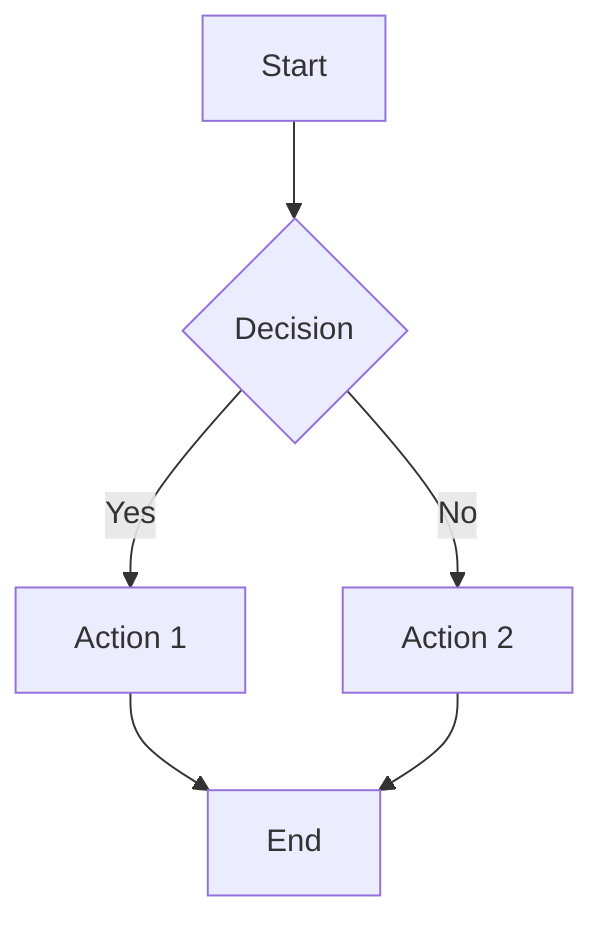
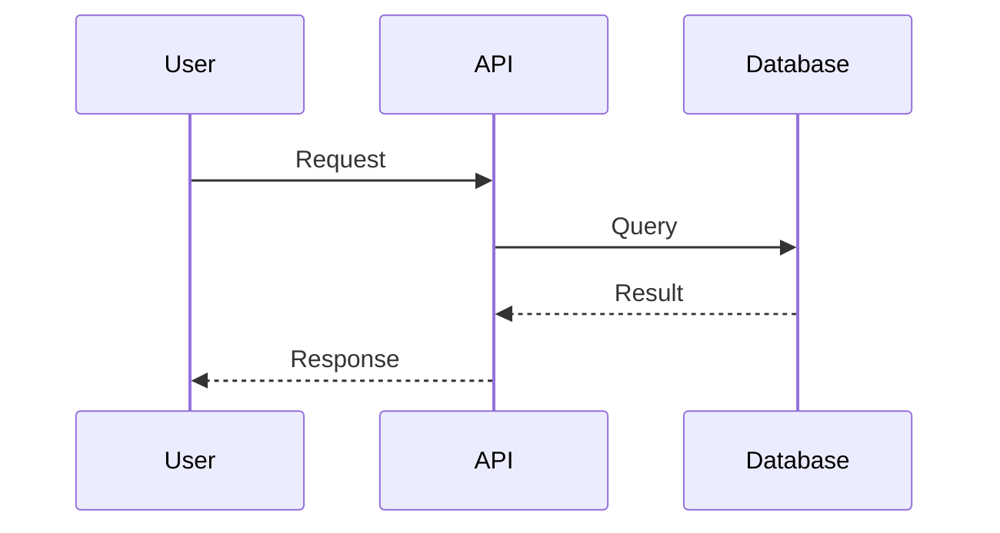
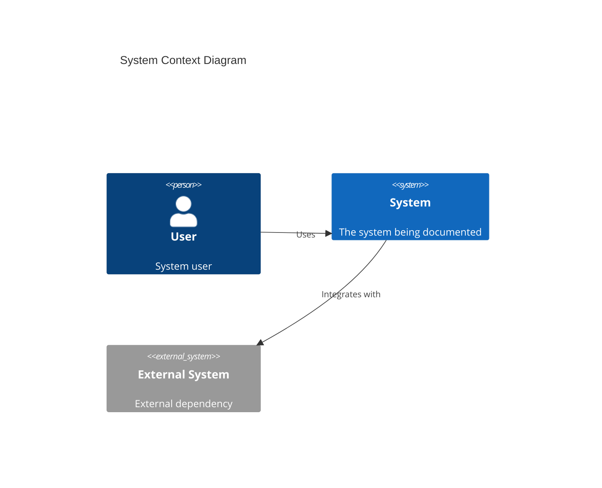

# Diagram Generation

Mermaid and C4 diagram generation for architecture visualization and documentation.

## Features

- **Mermaid diagrams**: Flowcharts, sequence diagrams, class diagrams, state diagrams, ERDs, git graphs
- **C4 model diagrams**: System context, container, and component level architecture documentation
- **Best practices guidance**: Naming conventions, styling, and layout recommendations
- **Documentation integration**: Seamless embedding in markdown documentation

## Installation

```bash
claude plugin install diagram-generation@guilde-plugins
```

## Usage

### Skills

#### `mermaid-generator`

Auto-activates for:
- Creating flowcharts, sequence diagrams, or architecture diagrams
- Mentions of "mermaid", "diagram", "visualize flow", "sequence diagram"
- Documenting system architecture or data flows
- Creating documentation with visual representation

**Supported Diagram Types:**
- Flowcharts (process flows, decision trees)
- Sequence diagrams (API interactions, auth flows)
- Class diagrams (domain models, OOP designs)
- State diagrams (state machines, workflows)
- Entity relationship diagrams (database schemas)
- Git graphs (branch strategies)

#### `c4-generator`

Auto-activates for:
- Architecture documentation requests
- Mentions of "C4 model", "system context", "container diagram", "component diagram"
- Documenting system architecture at different levels of detail
- Creating architecture decision records

**C4 Abstraction Levels:**
1. **Context** - System context showing actors and external systems
2. **Container** - High-level technical building blocks
3. **Component** - Components within containers
4. **Code** - Class/module level (optional)

## Example Diagrams

### Flowchart


### Sequence Diagram


### C4 Context Diagram


## Documentation Structure

Recommended placement:
```
docs/
  architecture/
    c4-context.md       # Level 1: Context
    c4-containers.md    # Level 2: Containers
    c4-components/      # Level 3: Components
    decisions/          # Architecture Decision Records
```

## Configuration

Place diagrams in markdown using fenced code blocks with `mermaid` language identifier.
