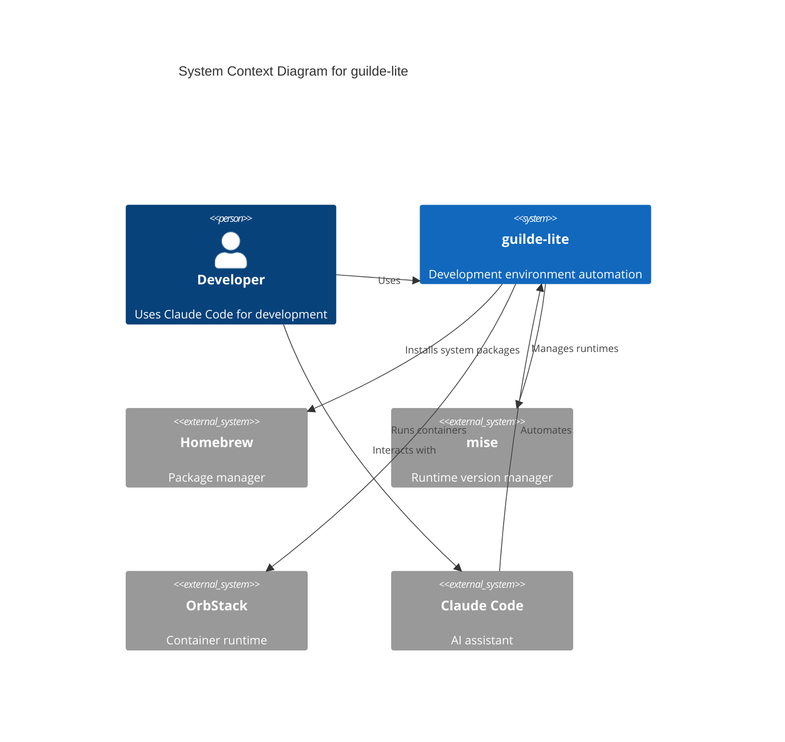
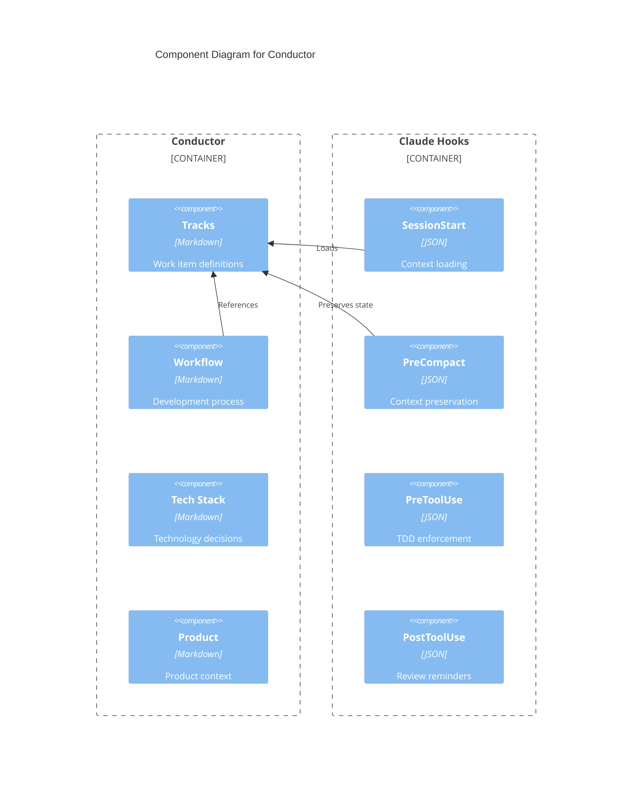
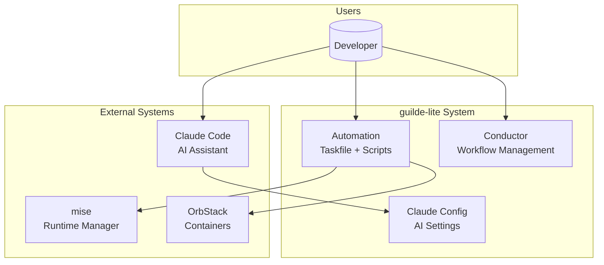

# C4 Model Generator

Expert at generating C4 model architecture diagrams.

## C4 Model Overview

The C4 model provides four levels of abstraction:

1. **Context** - System context showing actors and external systems
2. **Container** - High-level technical building blocks (apps, databases, etc.)
3. **Component** - Components within containers
4. **Code** - Class/module level (optional, often auto-generated)

## Level 1: System Context Diagram

Shows how the system fits into the world.



### Context Diagram Elements
- **Person**: Human users of the system
- **System**: The system being documented (highlighted)
- **System_Ext**: External systems that interact with your system
- **Rel**: Relationships between elements

## Level 2: Container Diagram

Shows the technical building blocks.

```mermaid
C4Container
    title Container Diagram for guilde-lite

    Person(dev, "Developer")

    System_Boundary(guilde, "guilde-lite") {
        Container(taskfile, "Taskfile", "YAML", "Task automation")
        Container(scripts, "Scripts", "Bash", "Automation scripts")
        Container(conductor, "Conductor", "Markdown", "Workflow orchestration")
        Container(claude_config, "Claude Config", "JSON/MD", "AI assistant configuration")
    }

    System_Boundary(databases, "Database Stack") {
        ContainerDb(postgres, "PostgreSQL", "Database", "Primary data store")
        ContainerDb(redis, "Redis", "Cache", "Caching and queues")
        ContainerDb(qdrant, "Qdrant", "Vector DB", "Embeddings storage")
    }

    Rel(dev, taskfile, "Runs tasks")
    Rel(taskfile, scripts, "Executes")
    Rel(scripts, databases, "Manages")
    Rel(dev, conductor, "Follows workflow")
    Rel(dev, claude_config, "Configures AI")
```

### Container Diagram Elements
- **Container**: Application, service, or data store
- **ContainerDb**: Database or storage system
- **System_Boundary**: Groups containers within a system

## Level 3: Component Diagram

Shows components within a container.



### Component Diagram Elements
- **Component**: A logical grouping of code
- **Container_Boundary**: The parent container

## C4 with Mermaid

Since native C4 support varies, you can also use standard Mermaid flowcharts:

### Alternative Context Diagram


## C4 Documentation Structure

Recommended documentation structure:
```
docs/
├── architecture/
│   ├── c4-context.md       # Level 1: Context
│   ├── c4-containers.md    # Level 2: Containers
│   ├── c4-components/      # Level 3: Components
│   │   ├── conductor.md
│   │   ├── automation.md
│   │   └── hooks.md
│   └── decisions/          # Architecture Decision Records
│       ├── ADR-001-mise-first.md
│       └── ADR-002-orbstack.md
```

## Generation Workflow

1. **Identify Scope**: Determine which C4 level is needed
2. **Map Actors**: List all people and external systems
3. **Define Boundaries**: Draw system and container boundaries
4. **Add Elements**: Place containers, components within boundaries
5. **Connect with Relationships**: Add relationship arrows with descriptions
6. **Review Abstraction Level**: Ensure appropriate detail for the level

## Best Practices

### Naming
- Use clear, consistent names
- Include technology in container descriptions
- Use action verbs for relationships

### Layout
- Keep diagrams focused on one level
- Group related elements
- Limit relationships to meaningful ones (not every possible connection)

### Documentation
- Always include a title
- Add descriptions for complex relationships
- Link to more detailed diagrams at lower levels

## Integration

Use the c4-architecture agents for comprehensive documentation:
- `c4-context` - System context level
- `c4-container` - Container level
- `c4-component` - Component level
- `c4-code` - Code level

## Commands

```bash
# Check architecture docs
bash scripts/doc-sync-check.sh check docs/architecture/c4-context.md

# Validate all documentation
task docs:validate
```
