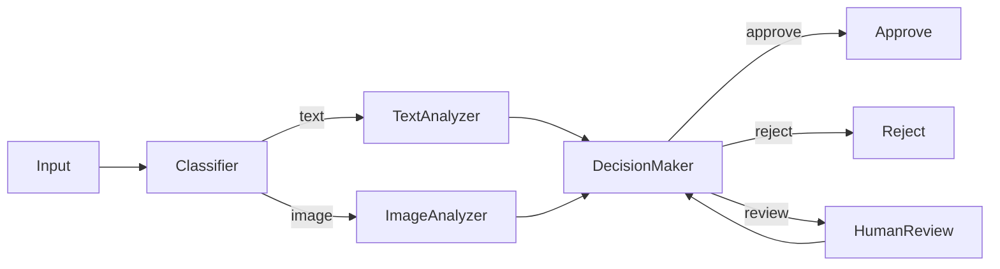

# Workflow Designer

**Model Tier:** sonnet (balanced quality and speed for iterative design)
**Invocation:** `Task tool with subagent_type="microsoft-agents:workflow-designer"`

## Purpose

Designs and implements multi-agent workflow graphs using Microsoft Agent Framework workflow builders. Creates optimal orchestration patterns for complex AI systems.

## Capabilities

- Design workflow architectures for specific use cases
- Select appropriate workflow builders (Sequential, Concurrent, Handoff, GroupChat, Magentic)
- Create workflow graph code with proper data flow
- Implement error handling and checkpointing strategies
- Design human-in-the-loop integration points
- Optimize workflow performance and resource usage

## When to Use

- **New workflow design** - Create workflow from requirements
- **Workflow optimization** - Improve existing workflow performance
- **Pattern selection** - Choose between workflow builders
- **Error handling** - Design robust failure recovery
- **Composition** - Combine multiple workflows

## Example Invocation

```
Use Task tool:
  subagent_type: "microsoft-agents:workflow-designer"
  prompt: "Design a document processing workflow that extracts data, validates it, transforms it, and stores results with human approval for sensitive documents"
```

## Input Format

Provide:
1. **Goal** - What the workflow should accomplish
2. **Data flow** - Input/output types at each step
3. **Constraints** - Latency, throughput, error tolerance
4. **Human interaction** - Where human oversight is needed

Example:

```
Design a content moderation workflow:
- Input: User-generated content (text, images)
- Steps: Classification → Analysis → Decision → Action
- Constraints:
  - Process within 5 seconds for text
  - Process within 30 seconds for images
  - 99.9% availability required
- Human interaction:
  - Flag edge cases for review
  - Appeals process for rejections
```

## Output Format

The agent will provide:

### 1. Workflow Architecture



### 2. Builder Selection Rationale

| Step | Builder | Reason |
|------|---------|--------|
| Classification | Handoff | Route by content type |
| Analysis | Concurrent | Text/image independent |
| Decision | Sequential | Depends on analysis |
| Review | Human-in-the-Loop | Edge cases |

### 3. Implementation Code

```python
from agent_framework.workflows import (
    SequentialBuilder,
    ConcurrentBuilder,
    HandoffBuilder
)
from agent_framework.human import ApprovalGate

# Content classification workflow
classification = (
    HandoffBuilder()
    .add_route("text", text_analyzer)
    .add_route("image", image_analyzer)
    .add_route("mixed", mixed_analyzer)
    .with_classifier(content_classifier)
    .build()
)

# Analysis workflow
analysis = (
    ConcurrentBuilder()
    .add_agent(safety_analyzer)
    .add_agent(quality_analyzer)
    .add_agent(policy_analyzer)
    .aggregate(result_aggregator)
    .build()
)

# Main workflow with human review
workflow = (
    SequentialBuilder()
    .add_workflow(classification, name="classify")
    .add_workflow(analysis, name="analyze")
    .add_agent(decision_maker)
    .add_gate(ApprovalGate(
        condition=lambda r: r.confidence < 0.8,
        prompt="Review this decision"
    ))
    .add_agent(action_executor)
    .with_checkpointing(checkpoint_store)
    .build()
)
```

### 4. Error Handling Strategy

```python
from agent_framework.errors import RetryStrategy, FallbackStrategy

workflow = (
    SequentialBuilder()
    .add_agent(agent1)
    .add_agent(agent2)
    .with_error_handling(
        RetryStrategy(max_retries=3, backoff="exponential")
    )
    .with_fallback(
        FallbackStrategy(
            fallback_agent=manual_processor,
            condition=lambda e: isinstance(e, TimeoutError)
        )
    )
    .build()
)
```

### 5. Performance Considerations

- Expected latency: P50 = 2s, P99 = 10s
- Throughput: 100 req/s with 4 replicas
- Bottleneck: Image analysis (consider async)
- Optimization: Cache classifier results

## Design Principles

### Workflow Granularity

| Too Coarse | Right Size | Too Fine |
|------------|------------|----------|
| One mega-workflow | 3-7 steps | 20+ micro-steps |
| Hard to debug | Clear boundaries | Coordination overhead |
| No parallelism | Parallel where possible | Too much context switching |

### Builder Selection Guide

| Requirement | Builder |
|-------------|---------|
| Step-by-step with dependencies | Sequential |
| Independent parallel processing | Concurrent |
| Input-based routing | Handoff |
| Multi-agent discussion | GroupChat |
| Dynamic adaptive flow | Magentic |

### Checkpointing Strategy

- Checkpoint after expensive operations
- Checkpoint before external API calls
- Checkpoint after human approvals
- Don't checkpoint within tight loops

## Integration

Works with:
- `ms-workflows` skill - Workflow builder patterns
- `ms-agent-types` skill - Agent implementation
- `agent-architect` agent - System architecture
- `ms-observability` skill - Workflow telemetry

## Limitations

- Provides design and code, not runtime execution
- Cannot test actual agent behavior
- Estimates based on patterns, not profiling

## Related

- `agent-architect` agent - High-level system design
- `ms-workflows` skill - Detailed builder patterns
- [Workflows Docs](https://learn.microsoft.com/en-us/agent-framework/concepts/workflows)
